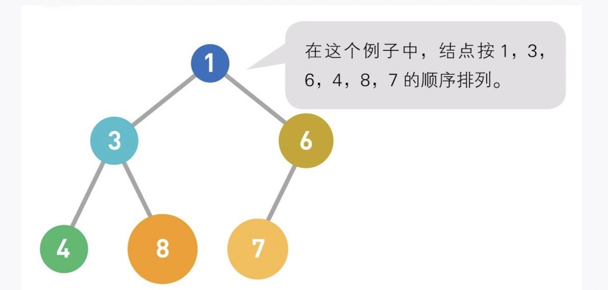
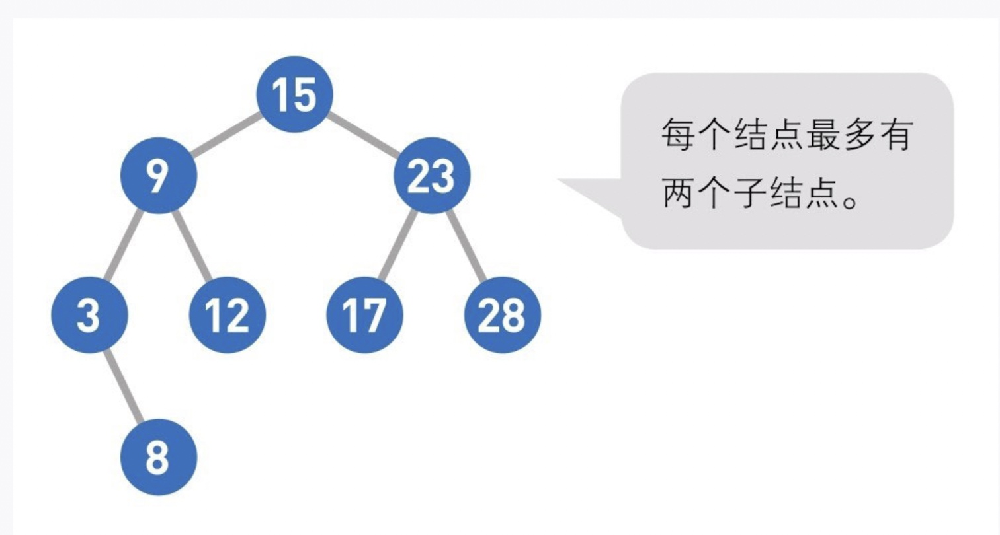
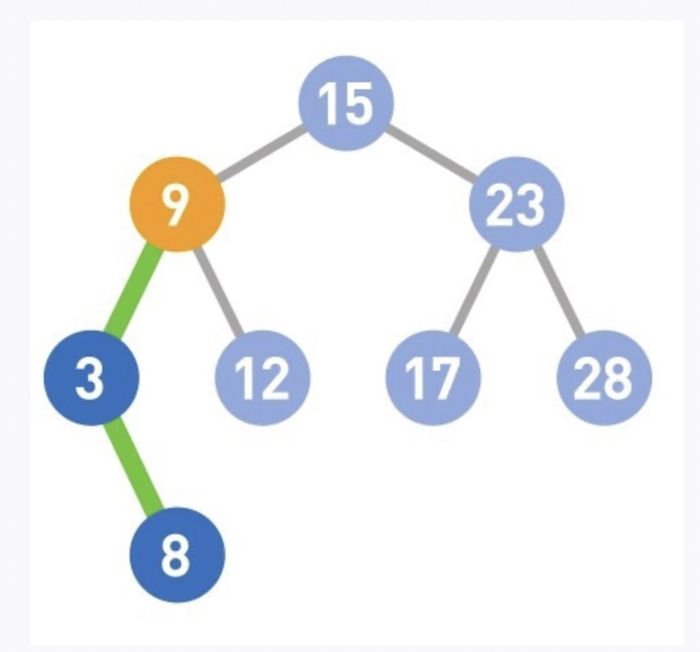
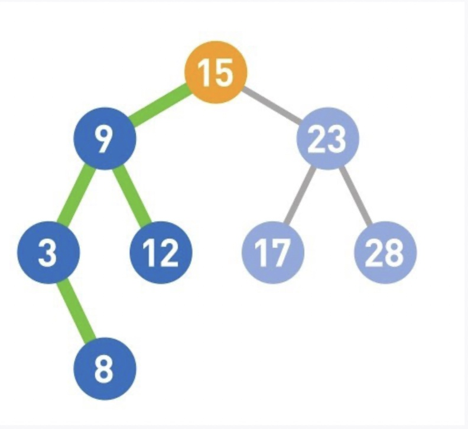
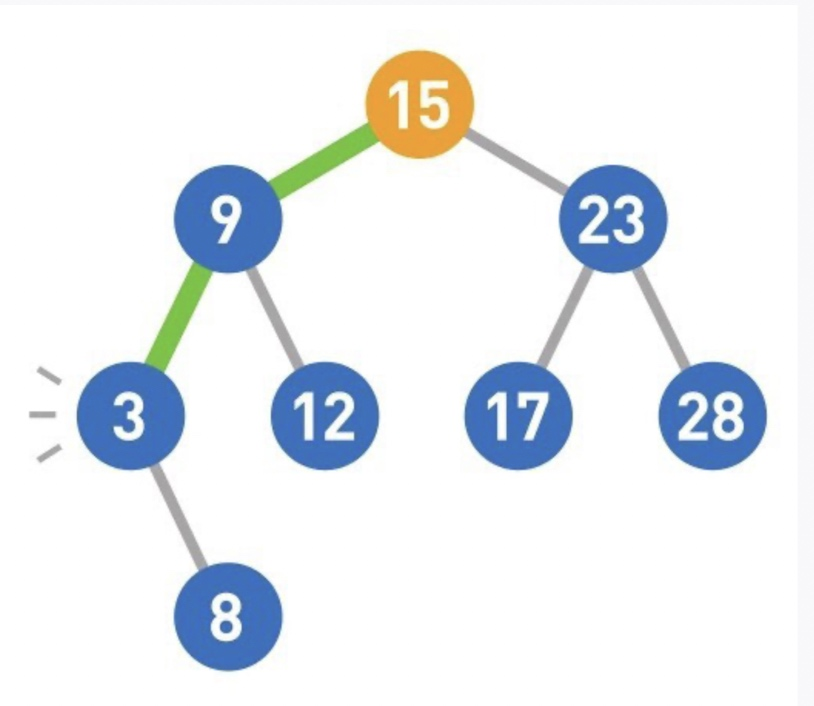
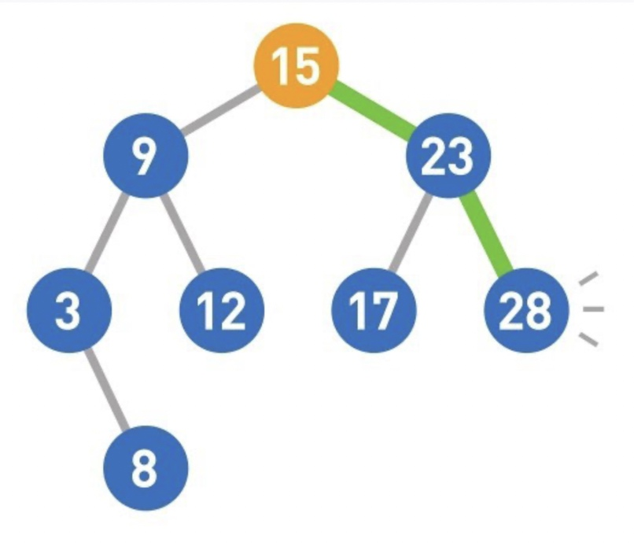
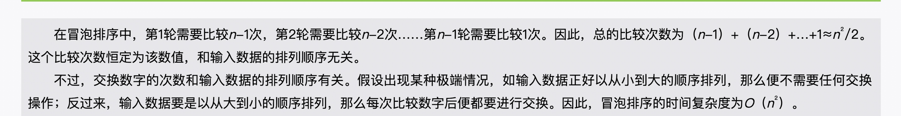

### 堆
堆是一种图的树形结构，被用于实现优先队列。优先队列是一种数据结构，可以自由添加数据，但取出数据时要从最小值开始按顺序取出。
在堆的树形结构中，各个顶点被称为"结点"（node)，数据就存储在这些结点中。

如果需要频繁地从管理的数据中取出最小值，那么使用堆来操作会非常方便。

### 二叉查找树
二叉查找树又叫二叉搜索树或二叉排序树，是一种数据结构，采用了图的树形结构，数据存储在二叉查找树的各个结点中。

二叉查找树有两个性质，第一个是每个结点的值均大于其左子树任意一个结点的值，比如结点9大于其左子树上的3和8。 

同样，结点15也大于其左子树上任意一个结点的值。

根据这两个性质可以得到以下结论，首先，二叉查找树的最小结点要从顶端开始，往其左下的末端寻找。此处最小值为3

发过来，二叉查找树的最大结点要从顶端开始，往其右下的末端寻找，此处最大值为28。

### 冒泡排序
重复"从序列右边开始比较相邻两个数字的大小，再根据结果交换两个数字的位置"，这一操作的算法。在这个过程中，数字会像泡泡一样，慢慢从右往左“浮”到序列的顶端，所以这个算法才被称为“冒泡排序”

