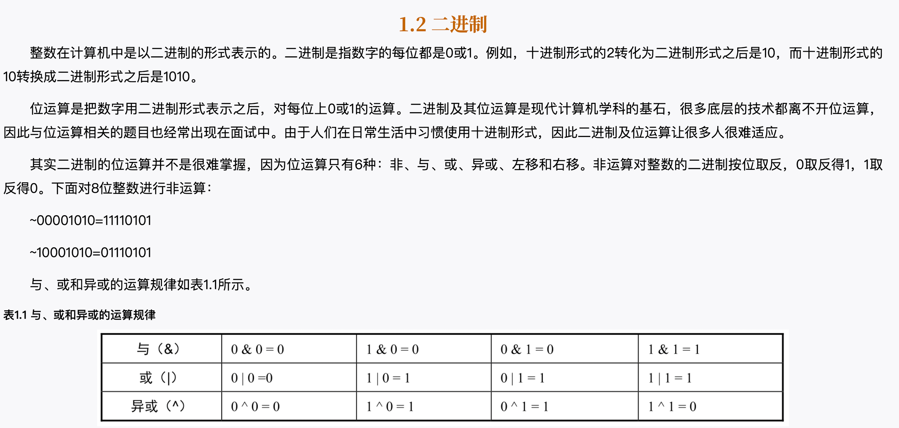
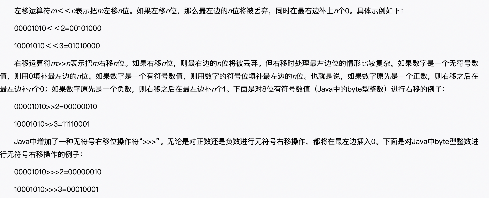

## 二进制

### 双指针
方向相反的双指针经常用来排序数组中的两个数字之和。
一个指针P1指向数组的第1个数字，另一个指针P2指向数组的最后一个数字，
然后比较两个指针指向的数字之和及一个目标值。如果两个指针指向的数字之和大于目标值，则向左移动指针P2；
如果两个指针指向的数字之和小于目标值，则向右移动指针P1。此时两个指针的移动方向是相反的。

方向相同的指针通常用来求正数数组中子数组的和或乘积。
初始化的时候两个指针P1和P2都指向数组的第1个数字。如果两个指针之间的子数组的和或乘积大于目标值，则向右移动指针P1删除子数组最左边的数字；
如果两个指针之间的子数组的和或乘积小于目标值，则向右移动指针P2在子数组的右边增加新的数字。此时两个指针的移动方向是相同的。