## 线程池的各个参数的含义？

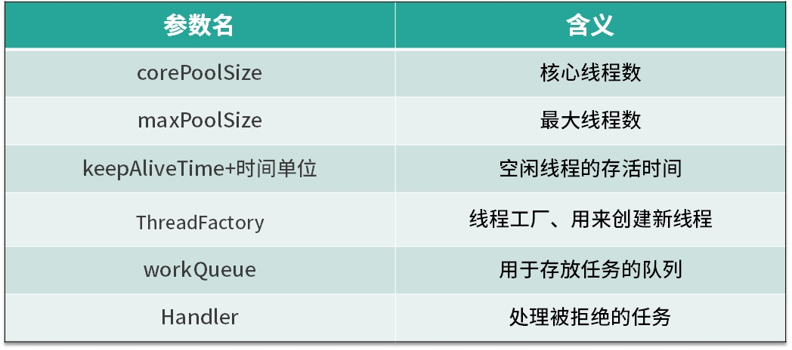
首先，我们来看下线程池中各个参数的含义，如表所示线程池主要有 6 个参数，其中第 3 个参数由 keepAliveTime + 时间单位组成。我们逐一看下它们各自的含义，corePoolSize 是核心线程数，也就是常驻线程池的线程数量，与它对应的是 maximumPoolSize，表示线程池最大线程数量，当我们的任务特别多而 corePoolSize 核心线程数无法满足需求的时候，就会向线程池中增加线程，以便应对任务突增的情况。

**线程创建的时机**
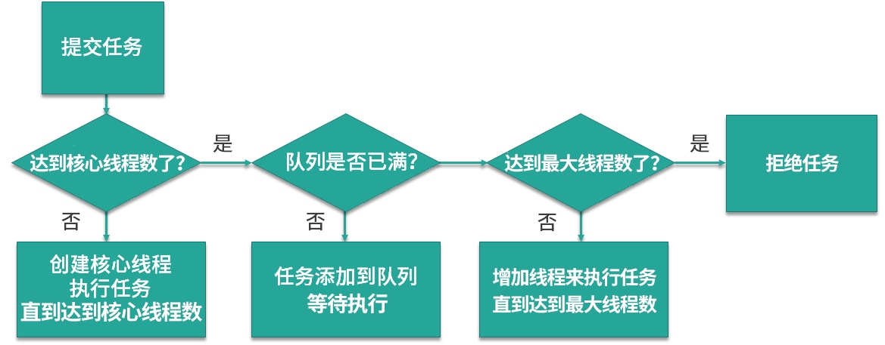接下来，我们来具体看下这两个参数所代表的含义，以及线程池中创建线程的时机。如上图所示，当提交任务后，线程池首先会检查当前线程数，如果此时线程数小于核心线程数，比如最开始线程数量为 0，则新建线程并执行任务，随着任务的不断增加，线程数会逐渐增加并达到核心线程数，此时如果仍有任务被不断提交，就会被放入 workQueue 任务队列中，等待核心线程执行完当前任务后重新从 workQueue 中提取正在等待被执行的任务。

 

此时，假设我们的任务特别的多，已经达到了 workQueue 的容量上限，这时线程池就会启动后备力量，也就是 maximumPoolSize 最大线程数，线程池会在 corePoolSize 核心线程数的基础上继续创建线程来执行任务，假设任务被不断提交，线程池会持续创建线程直到线程数达到 maximumPoolSize 最大线程数，如果依然有任务被提交，这就超过了线程池的最大处理能力，这个时候线程池就会拒绝这些任务，我们可以看到实际上任务进来之后，线程池会逐一判断 corePoolSize、workQueue、maximumPoolSize，如果依然不能满足需求，则会拒绝任务。

corePoolSize 与 maximumPoolSize   

通过上面的流程图，我们了解了 corePoolSize 和 maximumPoolSize 的具体含义，corePoolSize 指的是核心线程数，线程池初始化时线程数默认为 0，当有新的任务提交后，会创建新线程执行任务，如果不做特殊设置，此后线程数通常不会再小于 corePoolSize ，因为它们是核心线程，即便未来可能没有可执行的任务也不会被销毁。随着任务量的增加，在任务队列满了之后，线程池会进一步创建新线程，最多可以达到 maximumPoolSize 来应对任务多的场景，如果未来线程有空闲，大于 corePoolSize 的线程会被合理回收。所以正常情况下，线程池中的线程数量会处在 corePoolSize 与 maximumPoolSize 的闭区间内。

“长工”与“临时工”

我们可以把 corePoolSize 与 maximumPoolSize 比喻成长工与临时工，通常古代一个大户人家会有几个固定的长工，负责日常的工作，而大户人家起初肯定也是从零开始雇佣长工的。假如长工数量被老爷设定为 5 人，也就对应了 corePoolSize，不管这 5 个长工是忙碌还是空闲，都会一直在大户人家待着，可到了农忙或春节，长工的人手显然就不够用了，这时就需要雇佣更多的临时工，这些临时工就相当于在 corePoolSize 的基础上继续创建新线程，但临时工也是有上限的，也就对应了 maximumPoolSize，随着农忙或春节结束，老爷考虑到人工成本便会解约掉这些临时工，家里工人数量便会从 maximumPoolSize 降到 corePoolSize，所以老爷家的工人数量会一致保持在 corePoolSize 和 maximumPoolSize 的区间。
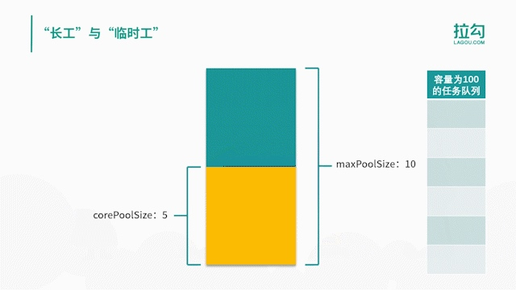
通过对流程图的理解和动画演示，我们总结出线程池的几个特点。

线程池希望保持较少的线程数，并且只有在负载变得很大时才增加线程。

线程池只有在任务队列填满时才创建多于 corePoolSize 的线程，如果使用的是无界队列（例如 LinkedBlockingQueue），那么由于队列不会满，所以线程数不会超过 corePoolSize。

通过设置 corePoolSize 和 maximumPoolSize 为相同的值，就可以创建固定大小的线程池。

通过设置 maximumPoolSize 为很高的值，例如 Integer.MAX_VALUE，就可以允许线程池创建任意多的线程。

keepAliveTime+时间单位     

第三个参数是 keepAliveTime + 时间单位，当线程池中线程数量多于核心线程数时，而此时又没有任务可做，线程池就会检测线程的 keepAliveTime，如果超过规定的时间，无事可做的线程就会被销毁，以便减少内存的占用和资源消耗。如果后期任务又多了起来，线程池也会根据规则重新创建线程，所以这是一个可伸缩的过程，比较灵活，我们也可以用 setKeepAliveTime 方法动态改变 keepAliveTime 的参数值。

ThreadFactory   

第四个参数是 ThreadFactory，ThreadFactory 实际上是一个线程工厂，它的作用是生产线程以便执行任务。我们可以选择使用默认的线程工厂，创建的线程都会在同一个线程组，并拥有一样的优先级，且都不是守护线程，我们也可以选择自己定制线程工厂，以方便给线程自定义命名，不同的线程池内的线程通常会根据具体业务来定制不同的线程名。

workQueue 和 Handler     

最后两个参数是 workQueue 和 Handler，它们分别对应阻塞队列和任务拒绝策略，在后面的课时会对它们进行详细展开讲解。

**有哪 6 种常见的线程池？什么是 Java8 的 ForkJoinPool？**

FixedThreadPool

CachedThreadPool

ScheduledThreadPool

SingleThreadExecutor

SingleThreadScheduledExecutor

ForkJoinPool


**FixedThreadPool**
第一种线程池叫作 FixedThreadPool，它的核心线程数和最大线程数是一样的，所以可以把它看作是固定线程数的线程池，它的特点是线程池中的线程数除了初始阶段需要从 0 开始增加外，之后的线程数量就是固定的，就算任务数超过线程数，线程池也不会再创建更多的线程来处理任务，而是会把超出线程处理能力的任务放到任务队列中进行等待。而且就算任务队列满了，到了本该继续增加线程数的时候，由于它的最大线程数和核心线程数是一样的，所以也无法再增加新的线程了。
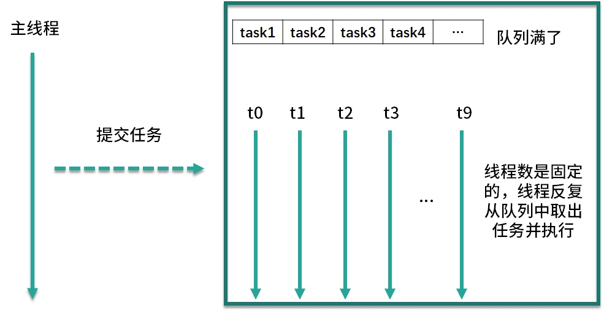
如图所示，线程池有 t0~t9，10 个线程，它们会不停地执行任务，如果某个线程任务执行完了，就会从任务队列中获取新的任务继续执行，期间线程数量不会增加也不会减少，始终保持在 10 个。


**CachedThreadPool**

第二种线程池是 CachedThreadPool，可以称作可缓存线程池，它的特点在于线程数是几乎可以无限增加的（实际最大可以达到 Integer.MAX_VALUE，为 2^31-1，这个数非常大，所以基本不可能达到），而当线程闲置时还可以对线程进行回收。也就是说该线程池的线程数量不是固定不变的，当然它也有一个用于存储提交任务的队列，但这个队列是 SynchronousQueue，队列的容量为0，实际不存储任何任务，它只负责对任务进行中转和传递，所以效率比较高。

当我们提交一个任务后，线程池会判断已创建的线程中是否有空闲线程，如果有空闲线程则将任务直接指派给空闲线程，如果没有空闲线程，则新建线程去执行任务，这样就做到了动态地新增线程。让我们举个例子，如下方代码所示。


**ScheduledThreadPool**
第三个线程池是 ScheduledThreadPool，它支持定时或周期性执行任务。比如每隔 10 秒钟执行一次任务，而实现这种功能的方法主要有 3 种，如代码所示：

第一种方法 schedule 比较简单，表示延迟指定时间后执行一次任务，如果代码中设置参数为 10 秒，也就是 10 秒后执行一次任务后就结束。

第二种方法 scheduleAtFixedRate 表示以固定的频率执行任务，它的第二个参数 initialDelay 表示第一次延时时间，第三个参数 period 表示周期，也就是第一次延时后每次延时多长时间执行一次任务。

第三种方法 scheduleWithFixedDelay 与第二种方法类似，也是周期执行任务，区别在于对周期的定义，之前的 scheduleAtFixedRate 是以任务开始的时间为时间起点开始计时，时间到就开始执行第二次任务，而不管任务需要花多久执行；而 scheduleWithFixedDelay 方法以任务结束的时间为下一次循环的时间起点开始计时。


**SingleThreadExecutor**
第四种线程池是 SingleThreadExecutor，它会使用唯一的线程去执行任务，原理和 FixedThreadPool 是一样的，只不过这里线程只有一个，如果线程在执行任务的过程中发生异常，线程池也会重新创建一个线程来执行后续的任务。这种线程池由于只有一个线程，**所以非常适合用于所有任务都需要按被提交的顺序依次执行的场景**，而前几种线程池不一定能够保障任务的执行顺序等于被提交的顺序，因为它们是多线程并行执行的。


**SingleThreadScheduledExecutor**
第五个线程池是 SingleThreadScheduledExecutor，它实际和第三种 ScheduledThreadPool 线程池非常相似，它只是 ScheduledThreadPool 的一个特例，内部只有一个线程，如源码所示：

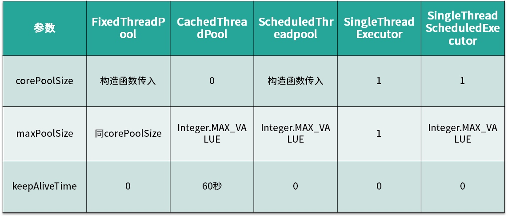


**ForkJoinPool**

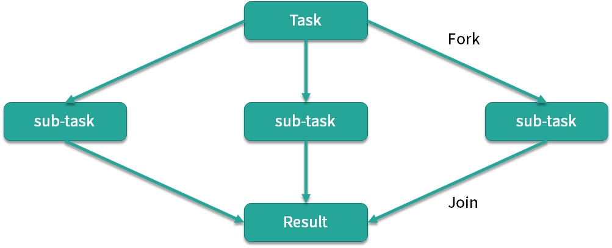
个线程池是在 JDK 7 加入的，它的名字 ForkJoin 也描述了它的执行机制，主要用法和之前的线程池是相同的，也是把任务交给线程池去执行，线程池中也有任务队列来存放任务。但是 ForkJoinPool 线程池和之前的线程池有两点非常大的不同之处。第一点它非常适合执行可以产生子任务的任务。


举个例子，比如面试中经常考到的菲波那切数列，你一定非常熟悉，这个数列的特点就是后一项的结果等于前两项的和，第 0 项是 0，第 1 项是 1，那么第 2 项就是 0+1=1，以此类推。我们在写代码时应该首选效率更高的迭代形式或者更高级的乘方或者矩阵公式法等写法，不过假设我们写成了最初版本的递归形式，伪代码如下所示：
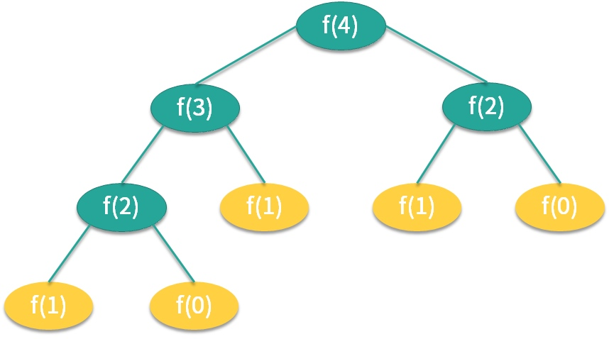
我们来看第二点不同，第二点不同之处在于内部结构，之前的线程池所有的线程共用一个队列，但 ForkJoinPool 线程池中每个线程都有自己独立的任务队列，如图所示。
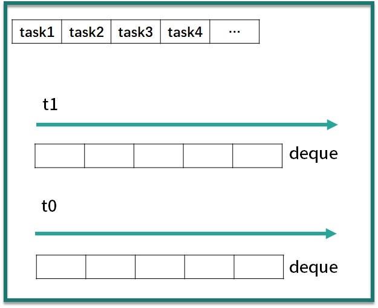


ForkJoinPool 线程池内部除了有一个共用的任务队列之外，每个线程还有一个对应的双端队列 deque，这时一旦线程中的任务被 Fork 分裂了，分裂出来的子任务放入线程自己的 deque 里，而不是放入公共的任务队列中。如果此时有三个子任务放入线程 t1 的 deque 队列中，对于线程 t1 而言获取任务的成本就降低了，可以直接在自己的任务队列中获取而不必去公共队列中争抢也不会发生阻塞（除了后面会讲到的 steal 情况外），减少了线程间的竞争和切换，是非常高效的。
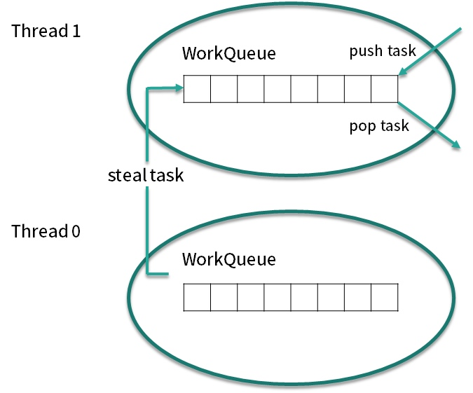

我们再考虑一种情况，此时线程有多个，而线程 t1 的任务特别繁重，分裂了数十个子任务，但是 t0 此时却无事可做，它自己的 deque 队列为空，这时为了提高效率，t0 就会想办法帮助 t1 执行任务，这就是“work-stealing”的含义。

双端队列 deque 中，线程 t1 获取任务的逻辑是后进先出，也就是LIFO（Last In Frist Out），而线程 t0 在“steal”偷线程 t1 的 deque 中的任务的逻辑是先进先出，也就是FIFO（Fast In Frist Out），如图所示，图中很好的描述了两个线程使用双端队列分别获取任务的情景。你可以看到，使用 “work-stealing” 算法和双端队列很好地平衡了各线程的负载。

最后，我们用一张全景图来描述 ForkJoinPool 线程池的内部结构，你可以看到 ForkJoinPool 线程池和其他线程池很多地方都是一样的，但重点区别在于它每个线程都有一个自己的双端队列来存储分裂出来的子任务。ForkJoinPool 非常适合用于递归的场景，例如树的遍历、最优路径搜索等场景。

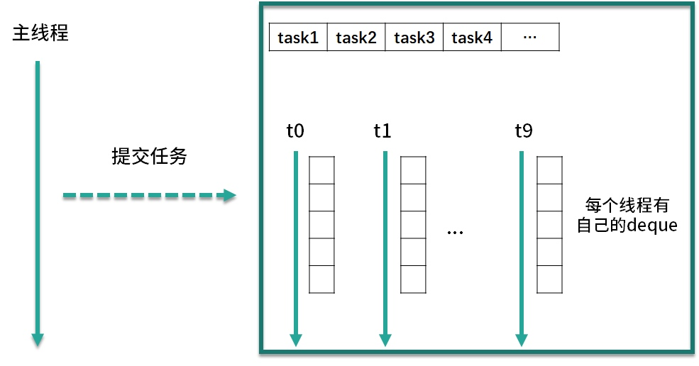

## 线程池常用的阻塞队列有哪些？
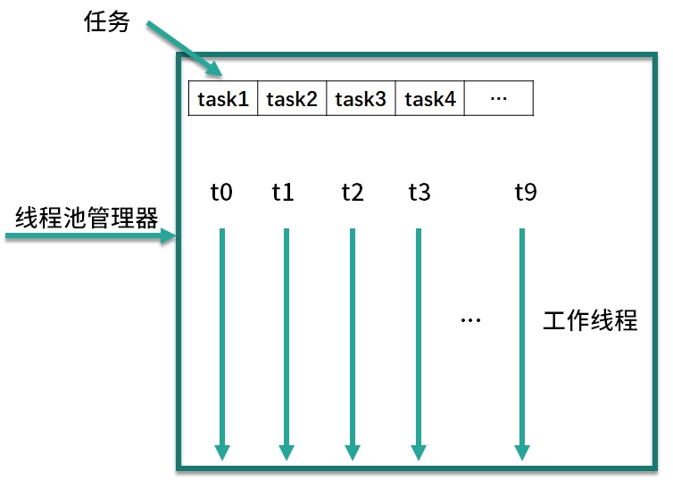
线程池的内部结构主要由四部分组成，如图所示。

第一部分是线程池管理器，它主要负责管理线程池的创建、销毁、添加任务等管理操作，它是整个线程池的管家。

第二部分是工作线程，也就是图中的线程 t0~t9，这些线程勤勤恳恳地从任务队列中获取任务并执行。

第三部分是任务队列，作为一种缓冲机制，线程池会把当下没有处理的任务放入任务队列中，由于多线程同时从任务队列中获取任务是并发场景，此时就需要任务队列满足线程安全的要求，所以线程池中任务队列采用 BlockingQueue 来保障线程安全。

第四部分是任务，任务要求实现统一的接口，以便工作线程可以处理和执行。

**阻塞队列**

LinkedBlockingQueue     
对于 FixedThreadPool 和 SingleThreadExector 而言，它们使用的阻塞队列是容量为 Integer.MAX_VALUE 的 LinkedBlockingQueue，可以认为是无界队列。由于 FixedThreadPool 线程池的线程数是固定的，所以没有办法增加特别多的线程来处理任务，这时就需要 LinkedBlockingQueue 这样一个没有容量限制的阻塞队列来存放任务。这里需要注意，由于线程池的任务队列永远不会放满，所以线程池只会创建核心线程数量的线程，所以此时的最大线程数对线程池来说没有意义，因为并不会触发生成多于核心线程数的线程。

SynchronousQueue      
第二种阻塞队列是 SynchronousQueue，对应的线程池是 CachedThreadPool。线程池 CachedThreadPool 的最大线程数是 Integer 的最大值，可以理解为线程数是可以无限扩展的。CachedThreadPool 和上一种线程池 FixedThreadPool 的情况恰恰相反，FixedThreadPool 的情况是阻塞队列的容量是无限的，而这里 CachedThreadPool 是线程数可以无限扩展，所以 CachedThreadPool 线程池并不需要一个任务队列来存储任务，因为一旦有任务被提交就直接转发给线程或者创建新线程来执行，而不需要另外保存它们。

DelayedWorkQueue       
第三种阻塞队列是DelayedWorkQueue，它对应的线程池分别是 ScheduledThreadPool 和 SingleThreadScheduledExecutor，这两种线程池的最大特点就是可以延迟执行任务，比如说一定时间后执行任务或是每隔一定的时间执行一次任务。DelayedWorkQueue 的特点是内部元素并不是按照放入的时间排序，而是会按照延迟的时间长短对任务进行排序，内部采用的是“堆”的数据结构。之所以线程池 ScheduledThreadPool 和 SingleThreadScheduledExecutor 选择 DelayedWorkQueue，是因为它们本身正是基于时间执行任务的，而延迟队列正好可以把任务按时间进行排序，方便任务的执行。

## 为什么不应该自动创建线程池？


FixedThreadPool、SingleThreadPool：使用的是无界队列（LinkedBlockingQueue），当任务堆积很多时，会占用大量内存，最终导致OOM。CachedTheadPool：可以无限创建线程（Integer.MAX_VALUE），任务过多时会导致创建线程达到操作系统上线或者发生OOM。ScheduledThreadPool、SingleThreadScheduledPool：使用的是DelayedWorkQueue队列，实质上也是一种无界队列，会导致OOM。


## 合适的线程数量是多少？CPU 核心数和线程数的关系？
CPU 密集型任务:
对于这样的任务最佳的线程数为 CPU 核心数的 1~2 倍

耗时 IO 型任务    
线程数 = CPU 核心数 *（1+平均等待时间/平均工作时间）
通过这个公式，我们可以计算出一个合理的线程数量，如果任务的平均等待时间长，线程数就随之增加，而如果平均工作时间长，也就是对于我们上面的 CPU 密集型任务，线程数就随之减少。

太少的线程数会使得程序整体性能降低，而过多的线程也会消耗内存等其他资源，所以如果想要更准确的话，可以进行压测，监控 JVM 的线程情况以及 CPU 的负载情况，根据实际情况衡量应该创建的线程数，合理并充分利用资源。

综上所述我们就可以得出一个结论：

线程的平均工作时间所占比例越高，就需要越少的线程；

线程的平均等待时间所占比例越高，就需要越多的线程；

针对不同的程序，进行对应的实际测试就可以得到最合适的选择。

## 如何根据实际需要，定制自己的线程池？


## 如何正确关闭线程池？shutdown 和 shutdownNow 的区别？

void shutdown;
boolean isShutdown;
boolean isTerminated;
boolean awaitTermination(long timeout, TimeUnit unit) throws InterruptedException;
List<Runnable> shutdownNow;

shutdown()
第一种方法叫作 shutdown()，它可以安全地关闭一个线程池，调用 shutdown() 方法之后线程池并不是立刻就被关闭，因为这时线程池中可能还有很多任务正在被执行，或是任务队列中有大量正在等待被执行的任务，调用 shutdown() 方法后线程池会在执行完正在执行的任务和队列中等待的任务后才彻底关闭。但这并不代表 shutdown() 操作是没有任何效果的，调用 shutdown() 方法后如果还有新的任务被提交，线程池则会根据拒绝策略直接拒绝后续新提交的任务。

isShutdown()
第二个方法叫作 isShutdown()，它可以返回 true 或者 false 来判断线程池是否已经开始了关闭工作，也就是是否执行了 shutdown 或者 shutdownNow 方法。这里需要注意，如果调用 isShutdown() 方法的返回的结果为 true 并不代表线程池此时已经彻底关闭了，这仅仅代表线程池开始了关闭的流程，也就是说，此时可能线程池中依然有线程在执行任务，队列里也可能有等待被执行的任务

isTerminated()
第三种方法叫作 isTerminated()，这个方法可以检测线程池是否真正“终结”了，这不仅代表线程池已关闭，同时代表线程池中的所有任务都已经都执行完毕了，因为我们刚才说过，调用 shutdown 方法之后，线程池会继续执行里面未完成的任务，不仅包括线程正在执行的任务，还包括正在任务队列中等待的任务。比如此时已经调用了 shutdown 方法，但是有一个线程依然在执行任务，那么此时调用 isShutdown 方法返回的是 true ，而调用 isTerminated 方法返回的便是 false ，因为线程池中还有任务正在在被执行，线程池并没有真正“终结”。直到所有任务都执行完毕了，调用 isTerminated() 方法才会返回 true，这表示线程池已关闭并且线程池内部是空的，所有剩余的任务都执行完毕了。

awaitTermination()
第四个方法叫作 awaitTermination()，它本身并不是用来关闭线程池的，而是主要用来判断线程池状态的。比如我们给 awaitTermination 方法传入的参数是 10 秒，那么它就会陷入 10 秒钟的等待，直到发生以下三种情况之一：

等待期间（包括进入等待状态之前）线程池已关闭并且所有已提交的任务（包括正在执行的和队列中等待的）都执行完毕，相当于线程池已经“终结”了，方法便会返回 true；
等待超时时间到后，第一种线程池“终结”的情况始终未发生，方法返回 false；
等待期间线程被中断，方法会抛出 InterruptedException 异常。
也就是说，调用 awaitTermination 方法后当前线程会尝试等待一段指定的时间，如果在等待时间内，线程池已关闭并且内部的任务都执行完毕了，也就是说线程池真正“终结”了，那么方法就返回 true，否则超时返回 fasle。

我们则可以根据 awaitTermination() 返回的布尔值来判断下一步应该执行的操作。

shutdownNow()
最后一个方法是 shutdownNow()，也是 5 种方法里功能最强大的，它与第一种 shutdown 方法不同之处在于名字中多了一个单词 Now，也就是表示立刻关闭的意思。在执行 shutdownNow 方法之后，首先会给所有线程池中的线程发送 interrupt 中断信号，尝试中断这些任务的执行，然后会将任务队列中正在等待的所有任务转移到一个 List 中并返回，我们可以根据返回的任务 List 来进行一些补救的操作，例如记录在案并在后期重试。shutdownNow() 的源码如下所示。


**线程池实现“线程复用”的原理？**

我们接下来具体看看代码是如何实现的，我们从 execute 方法开始分析，源码如下所示。

    public void execute(Runnable command) { 
    
    if (command == null) 
    
        throw new NullPointerException();
    
    int c = ctl.get();
    
    if (workerCountOf(c) < corePoolSize) { 
    
        if (addWorker(command, true)) 
    
            return;
    
        c = ctl.get();
    
    } 
    
    if (isRunning(c) && workQueue.offer(command)) { 
    
        int recheck = ctl.get();
    
        if (! isRunning(recheck) && remove(command)) 
    
            reject(command);
    
        else if (workerCountOf(recheck) == 0) 
    
            addWorker(null, false);
    
    } 
    
    else if (!addWorker(command, false)) 
    
        reject(command);
        
    }    

可以看出，实现线程复用的逻辑主要在一个不停循环的 while 循环体中。

1. 通过取 Worker 的 firstTask 或者通过 getTask 方法从 workQueue 中获取待执行的任务。
2. 直接调用 task 的 run 方法来执行具体的任务（而不是新建线程）。

在这里，我们找到了最终的实现，通过取 Worker 的 firstTask 或者 getTask方法从 workQueue 中取出了新任务，并直接调用 Runnable 的 run 方法来执行任务，也就是如之前所说的，每个线程都始终在一个大循环中，反复获取任务，然后执行任务，从而实现了线程的复用。


**你知道哪几种锁？分别有什么特点？**


根据分类标准我们把锁分为以下 7 大类别，分别是：

偏向锁/轻量级锁/重量级锁；

可重入锁/非可重入锁；

共享锁/独占锁；

公平锁/非公平锁；

悲观锁/乐观锁；

自旋锁/非自旋锁；

可中断锁/不可中断锁。


偏向锁/轻量级锁/重量级锁

第一种分类是偏向锁/轻量级锁/重量级锁，这三种锁特指 synchronized 锁的状态，通过在对象头中的 mark word 来表明锁的状态。


偏向锁

如果自始至终，对于这把锁都不存在竞争，那么其实就没必要上锁，只需要打个标记就行了，这就是偏向锁的思想。一个对象被初始化后，还没有任何线程来获取它的锁时，那么它就是可偏向的，当有第一个线程来访问它并尝试获取锁的时候，它就将这个线程记录下来，以后如果尝试获取锁的线程正是偏向锁的拥有者，就可以直接获得锁，开销很小，性能最好。

轻量级锁

JVM 开发者发现在很多情况下，synchronized 中的代码是被多个线程交替执行的，而不是同时执行的，也就是说并不存在实际的竞争，或者是只有短时间的锁竞争，用 CAS 就可以解决，这种情况下，用完全互斥的重量级锁是没必要的。轻量级锁是指当锁原来是偏向锁的时候，被另一个线程访问，说明存在竞争，那么偏向锁就会升级为轻量级锁，线程会通过自旋的形式尝试获取锁，而不会陷入阻塞。

重量级锁

重量级锁是互斥锁，它是利用操作系统的同步机制实现的，所以开销相对比较大。当多个线程直接有实际竞争，且锁竞争时间长的时候，轻量级锁不能满足需求，锁就会膨胀为重量级锁。重量级锁会让其他申请却拿不到锁的线程进入阻塞状态。

   


综上所述，偏向锁性能最好，可以避免执行 CAS 操作。而轻量级锁利用自旋和 CAS 避免了重量级锁带来的线程阻塞和唤醒，性能中等。重量级锁则会把获取不到锁的线程阻塞，性能最差。

可重入锁/非可重入锁

第 2 个分类是可重入锁和非可重入锁。可重入锁指的是线程当前已经持有这把锁了，能在不释放这把锁的情况下，再次获取这把锁。同理，不可重入锁指的是虽然线程当前持有了这把锁，但是如果想再次获取这把锁，也必须要先释放锁后才能再次尝试获取。

 

对于可重入锁而言，最典型的就是 ReentrantLock 了，正如它的名字一样，reentrant 的意思就是可重入，它也是 Lock 接口最主要的一个实现类。

共享锁/独占锁

第 3 种分类标准是共享锁和独占锁。共享锁指的是我们同一把锁可以被多个线程同时获得，而独占锁指的就是，这把锁只能同时被一个线程获得。我们的读写锁，就最好地诠释了共享锁和独占锁的理念。读写锁中的读锁，是共享锁，而写锁是独占锁。读锁可以被同时读，可以同时被多个线程持有，而写锁最多只能同时被一个线程持有。

公平锁/非公平锁

第 4 种分类是公平锁和非公平锁。公平锁的公平的含义在于如果线程现在拿不到这把锁，那么线程就都会进入等待，开始排队，在等待队列里等待时间长的线程会优先拿到这把锁，有先来先得的意思。而非公平锁就不那么“完美”了，它会在一定情况下，忽略掉已经在排队的线程，发生插队现象。

悲观锁/乐观锁

第 5 种分类是悲观锁，以及与它对应的乐观锁。悲观锁的概念是在获取资源之前，必须先拿到锁，以便达到“独占”的状态，当前线程在操作资源的时候，其他线程由于不能拿到锁，所以其他线程不能来影响我。而乐观锁恰恰相反，它并不要求在获取资源前拿到锁，也不会锁住资源；相反，乐观锁利用 CAS 理念，在不独占资源的情况下，完成了对资源的修改。

自旋锁/非自旋锁

第 6 种分类是自旋锁与非自旋锁。自旋锁的理念是如果线程现在拿不到锁，并不直接陷入阻塞或者释放 CPU 资源，而是开始利用循环，不停地尝试获取锁，这个循环过程被形象地比喻为“自旋”，就像是线程在“自我旋转”。相反，非自旋锁的理念就是没有自旋的过程，如果拿不到锁就直接放弃，或者进行其他的处理逻辑，例如去排队、陷入阻塞等。

可中断锁/不可中断锁

第 7 种分类是可中断锁和不可中断锁。在 Java 中，synchronized 关键字修饰的锁代表的是不可中断锁，一旦线程申请了锁，就没有回头路了，只能等到拿到锁以后才能进行其他的逻辑处理。而我们的 ReentrantLock 是一种典型的可中断锁，例如使用 lockInterruptibly 方法在获取锁的过程中，突然不想获取了，那么也可以在中断之后去做其他的事情，不需要一直傻等到获取到锁才离开。


**首先我们看下悲观锁与乐观锁是如何进行分类的**，悲观锁和乐观锁是从是否锁住资源的角度进行分类的。

**悲观锁**


我们举个例子，假设线程 A 和 B 使用的都是悲观锁，所以它们在尝试获取同步资源时，必须要先拿到锁。


假设线程 A 拿到了锁，并且正在操作同步资源，那么此时线程 B 就必须进行等待。


而当线程 A 执行完毕后，CPU 才会唤醒正在等待这把锁的线程 B 再次尝试获取锁。


如果线程 B 现在获取到了锁，才可以对同步资源进行自己的操作。这就是悲观锁的操作流程。

**乐观锁**
乐观锁比较乐观，认为自己在操作资源的时候不会有其他线程来干扰，所以并不会锁住被操作对象，不会不让别的线程来接触它，同时，为了确保数据正确性，在更新之前，会去对比在我修改数据期间，数据有没有被其他线程修改过：如果没被修改过，就说明真的只有我自己在操作，那我就可以正常的修改数据；如果发现数据和我一开始拿到的不一样了，说明其他线程在这段时间内修改过数据，那说明我迟了一步，所以我会放弃这次修改，并选择报错、重试等策略。


乐观锁的实现一般都是利用 CAS 算法实现的。我们举个例子，假设线程 A 此时运用的是乐观锁。那么它去操作同步资源的时候，不需要提前获取到锁，而是可以直接去读取同步资源，并且在自己的线程内进行计算。


当它计算完毕之后、准备更新同步资源之前，会先判断这个资源是否已经被其他线程所修改过。


如果这个时候同步资源没有被其他线程修改更新，也就是说此时的数据和线程 A 最开始拿到的数据是一致的话，那么此时线程 A 就会去更新同步资源，完成修改的过程。


而假设此时的同步资源已经被其他线程修改更新了，线程 A 会发现此时的数据已经和最开始拿到的数据不一致了，那么线程 A 不会继续修改该数据，而是会根据不同的业务逻辑去选择报错或者重试。

悲观锁和乐观锁概念并不是 Java 中独有的，这是一种广义的思想，这种思想可以应用于其他领域，比如说在数据库中，同样也有对悲观锁和乐观锁的应用。

**典型案例**
悲观锁：synchronized 关键字和 Lock 接口
Java 中悲观锁的实现包括 synchronized 关键字和 Lock 相关类等，我们以 Lock 接口为例，例如 Lock 的实现类 ReentrantLock，类中的 lock() 等方法就是执行加锁，而 unlock() 方法是执行解锁。处理资源之前必须要先加锁并拿到锁，等到处理完了之后再解开锁，这就是非常典型的悲观锁思想。

乐观锁：原子类
乐观锁的典型案例就是原子类，例如 AtomicInteger 在更新数据时，就使用了乐观锁的思想，多个线程可以同时操作同一个原子变量。

大喜大悲：数据库
数据库中同时拥有悲观锁和乐观锁的思想。例如，我们如果在 MySQL 选择 select for update 语句，那就是悲观锁，在提交之前不允许第三方来修改该数据，这当然会造成一定的性能损耗，在高并发的情况下是不可取的。

相反，我们可以利用一个版本 version 字段在数据库中实现乐观锁。在获取及修改数据时都不需要加锁，但是我们在获取完数据并计算完毕，准备更新数据时，会检查版本号和获取数据时的版本号是否一致，如果一致就直接更新，如果不一致，说明计算期间已经有其他线程修改过这个数据了，那我就可以选择重新获取数据，重新计算，然后再次尝试更新数据。

`UPDATE student

    SET 
    
        name = ‘小李’,
    
        version= 2
    
    WHERE   id= 100
    
        AND version= 1`
### 两种锁各自的使用场景

悲观锁适合用于并发写入多、临界区代码复杂、竞争激烈等场景，这种场景下悲观锁可以避免大量的无用的反复尝试等消耗。

乐观锁适用于大部分是读取，少部分是修改的场景，也适合虽然读写都很多，但是并发并不激烈的场景。在这些场景下，乐观锁不加锁的特点能让性能大幅提高。


  Last modified 2022年1月1日; size 533 bytes
  MD5 checksum fc73d1d80fe201809a3fcdd9098003c8
  Compiled from "SynTest.java"
public class com.janson.thread.chapter12.SynTest
  minor version: 0
  major version: 52
  flags: (0x0021) ACC_PUBLIC, ACC_SUPER
  this_class: #5                          // com/janson/thread/chapter12/SynTest
  super_class: #6                         // java/lang/Object
  interfaces: 0, fields: 0, methods: 2, attributes: 1
Constant pool:
   #1 = Methodref          #6.#18         // java/lang/Object."<init>":()V
   #2 = Fieldref           #19.#20        // java/lang/System.out:Ljava/io/PrintStream;
   #3 = String             #21            // xiaoLi
   #4 = Methodref          #22.#23        // java/io/PrintStream.println:(Ljava/lang/String;)V
   #5 = Class              #24            // com/janson/thread/chapter12/SynTest
   #6 = Class              #25            // java/lang/Object
   #7 = Utf8               <init>
   #8 = Utf8               ()V
   #9 = Utf8               Code
  #10 = Utf8               LineNumberTable
  #11 = Utf8               synBlock
  #12 = Utf8               StackMapTable
  #13 = Class              #24            // com/janson/thread/chapter12/SynTest
  #14 = Class              #25            // java/lang/Object
  #15 = Class              #26            // java/lang/Throwable
  #16 = Utf8               SourceFile
  #17 = Utf8               SynTest.java
  #18 = NameAndType        #7:#8          // "<init>":()V
  #19 = Class              #27            // java/lang/System
  #20 = NameAndType        #28:#29        // out:Ljava/io/PrintStream;
  #21 = Utf8               xiaoLi
  #22 = Class              #30            // java/io/PrintStream
  #23 = NameAndType        #31:#32        // println:(Ljava/lang/String;)V
  #24 = Utf8               com/janson/thread/chapter12/SynTest
  #25 = Utf8               java/lang/Object
  #26 = Utf8               java/lang/Throwable
  #27 = Utf8               java/lang/System
  #28 = Utf8               out
  #29 = Utf8               Ljava/io/PrintStream;
  #30 = Utf8               java/io/PrintStream
  #31 = Utf8               println
  #32 = Utf8               (Ljava/lang/String;)V
{
  public com.janson.thread.chapter12.SynTest();
    descriptor: ()V
    flags: (0x0001) ACC_PUBLIC
    Code:
      stack=1, locals=1, args_size=1
         0: aload_0
         1: invokespecial #1                  // Method java/lang/Object."<init>":()V
         4: return
      LineNumberTable:
        line 8: 0

  public void synBlock();
    descriptor: ()V
    flags: (0x0001) ACC_PUBLIC
    Code:
      stack=2, locals=3, args_size=1
         0: aload_0
         1: dup
         2: astore_1
         3: monitorenter
         4: getstatic     #2                  // Field java/lang/System.out:Ljava/io/PrintStream;
         7: ldc           #3                  // String xiaoLi
         9: invokevirtual #4                  // Method java/io/PrintStream.println:(Ljava/lang/String;)V
        12: aload_1
        13: monitorexit
        14: goto          22
        17: astore_2
        18: aload_1
        19: monitorexit
        20: aload_2
        21: athrow
        22: return
      Exception table:
         from    to  target type
             4    14    17   any
            17    20    17   any
      LineNumberTable:
        line 10: 0
        line 11: 4
        line 12: 12
        line 13: 22
      StackMapTable: number_of_entries = 2
        frame_type = 255 /* full_frame */
          offset_delta = 17
          locals = [ class com/janson/thread/chapter12/SynTest, class java/lang/Object ]
          stack = [ class java/lang/Throwable ]
        frame_type = 250 /* chop */
          offset_delta = 4
}
SourceFile: "SynTest.java"


13、19行指令分别对应的是 monitorenter 和 monitorexit。这里有一个 monitorenter，却有两个 monitorexit 指令的原因是，JVM 要保证每个 monitorenter 必须有与之对应的 monitorexit，monitorenter 指令被插入到同步代码块的开始位置，而 monitorexit 需要插入到方法正常结束处和异常处两个地方，这样就可以保证抛异常的情况下也能释放锁

**monitorenter**
执行 monitorenter 的线程尝试获得 monitor 的所有权，会发生以下这三种情况之一：

a. 如果该 monitor 的计数为 0，则线程获得该 monitor 并将其计数设置为 1。然后，该线程就是这个 monitor 的所有者。

b. 如果线程已经拥有了这个 monitor ，则它将重新进入，并且累加计数。

c. 如果其他线程已经拥有了这个 monitor，那个这个线程就会被阻塞，直到这个 monitor 的计数变成为 0，代表这个 monitor 已经被释放了，于是当前这个线程就会再次尝试获取这个 monitor。

**monitorexit**
monitorexit 的作用是将 monitor 的计数器减 1，直到减为 0 为止。代表这个 monitor 已经被释放了，已经没有任何线程拥有它了，也就代表着解锁，所以，其他正在等待这个 monitor 的线程，此时便可以再次尝试获取这个 monitor 的所有权。


**同步方法**
从上面可以看出，同步代码块是使用 monitorenter 和 monitorexit 指令实现的。而对于 synchronized 方法，并不是依靠 monitorenter 和 monitorexit 指令实现的，被 javap 反汇编后可以看到，synchronized 方法和普通方法大部分是一样的，不同在于，这个方法会有一个叫作 ACC_SYNCHRONIZED 的 flag 修饰符，来表明它是同步方法。


  Last modified 2022年1月3日; size 441 bytes
  MD5 checksum 7cc342ba40aeed2b78c09f9e3b319a05
  Compiled from "SyncMethodTest.java"
public class com.janson.thread.chapter12.SyncMethodTest
  minor version: 0
  major version: 55
  flags: (0x0021) ACC_PUBLIC, ACC_SUPER
  this_class: #5                          // com/janson/thread/chapter12/SyncMethodTest
  super_class: #6                         // java/lang/Object
  interfaces: 0, fields: 0, methods: 2, attributes: 1
Constant pool:
   #1 = Methodref          #6.#14         // java/lang/Object."<init>":()V
   #2 = Fieldref           #15.#16        // java/lang/System.out:Ljava/io/PrintStream;
   #3 = String             #17            // sync method
   #4 = Methodref          #18.#19        // java/io/PrintStream.println:(Ljava/lang/String;)V
   #5 = Class              #20            // com/janson/thread/chapter12/SyncMethodTest
   #6 = Class              #21            // java/lang/Object
   #7 = Utf8               <init>
   #8 = Utf8               ()V
   #9 = Utf8               Code
  #10 = Utf8               LineNumberTable
  #11 = Utf8               synMethod
  #12 = Utf8               SourceFile
  #13 = Utf8               SyncMethodTest.java
  #14 = NameAndType        #7:#8          // "<init>":()V
  #15 = Class              #22            // java/lang/System
  #16 = NameAndType        #23:#24        // out:Ljava/io/PrintStream;
  #17 = Utf8               sync method
  #18 = Class              #25            // java/io/PrintStream
  #19 = NameAndType        #26:#27        // println:(Ljava/lang/String;)V
  #20 = Utf8               com/janson/thread/chapter12/SyncMethodTest
  #21 = Utf8               java/lang/Object
  #22 = Utf8               java/lang/System
  #23 = Utf8               out
  #24 = Utf8               Ljava/io/PrintStream;
  #25 = Utf8               java/io/PrintStream
  #26 = Utf8               println
  #27 = Utf8               (Ljava/lang/String;)V
{
  public com.janson.thread.chapter12.SyncMethodTest();
    descriptor: ()V
    flags: (0x0001) ACC_PUBLIC
    Code:
      stack=1, locals=1, args_size=1
         0: aload_0
         1: invokespecial #1                  // Method java/lang/Object."<init>":()V
         4: return
      LineNumberTable:
        line 8: 0

  public synchronized void synMethod();
    descriptor: ()V
    flags: (0x0021) ACC_PUBLIC, ACC_SYNCHRONIZED
    Code:
      stack=2, locals=1, args_size=1
         0: getstatic     #2                  // Field java/lang/System.out:Ljava/io/PrintStream;
         3: ldc           #3                  // String sync method
         5: invokevirtual #4                  // Method java/io/PrintStream.println:(Ljava/lang/String;)V
         8: return
      LineNumberTable:
        line 10: 0
        line 11: 8
}
SourceFile: "SyncMethodTest.java"

可以看出，被 synchronized 修饰的方法会有一个 ACC_SYNCHRONIZED 标志。当某个线程要访问某个方法的时候，会首先检查方法是否有 ACC_SYNCHRONIZED 标志，如果有则需要先获得 monitor 锁，然后才能开始执行方法，方法执行之后再释放 monitor 锁。其他方面， synchronized 方法和刚才的 synchronized 代码块是很类似的，例如这时如果其他线程来请求执行方法，也会因为无法获得 monitor 锁而被阻塞。


**如何看到 synchronized 背后的“monitor 锁”？**


我们都知道，最简单的同步方式就是利用 synchronized 关键字来修饰代码块或者修饰一个方法，那么这部分被保护的代码，在同一时刻就最多只有一个线程可以运行，而 synchronized 的背后正是利用 monitor 锁实现的。所以首先我们来看下获取和释放 monitor 锁的时机，每个 Java 对象都可以用作一个实现同步的锁，这个锁也被称为内置锁或 monitor 锁，获得 monitor 锁的唯一途径就是进入由这个锁保护的同步代码块或同步方法，线程在进入被 synchronized 保护的代码块之前，会自动获取锁，并且无论是正常路径退出，还是通过抛出异常退出，在退出的时候都会自动释放锁。

我们首先来看一个 synchronized 修饰方法的代码的例子：

复制代码
public synchronized void method() {
    method body
}
我们看到 method() 方法是被 synchronized 修饰的，为了方便理解其背后的原理，我们把上面这段代码改写为下面这种等价形式的伪代码。

复制代码
public void method() {
    this.intrinsicLock.lock();
    try{
        method body
    }
    finally {
        this.intrinsicLock.unlock();
    }
}
在这种写法中，进入 method 方法后，立刻添加内置锁，并且用 try 代码块把方法保护起来，最后用 finally 释放这把锁，这里的 intrinsicLock 就是 monitor 锁。经过这样的伪代码展开之后，相信你对 synchronized 的理解就更加清晰了。

用 javap 命令查看反汇编的结果
JVM 实现 synchronized 方法和 synchronized 代码块的细节是不一样的，下面我们就分别来看一下两者的实现。

javac SynTest.java          
javap -verbose SynTest.class 


happens-before原则定义如下：

**1. 如果一个操作happens-before另一个操作，那么第一个操作的执行结果将对第二个操作可见，而且第一个操作的执行顺序排在第二个操作之前。**


**2. 两个操作之间存在happens-before关系，并不意味着一定要按照happens-before原则制定的顺序来执行。如果重排序之后的执行结果与按照happens-before关系来执行的结果一致，那么这种重排序并不非法。**


下面是happens-before原则规则：

1. 程序次序规则：一个线程内，按照代码顺序，书写在前面的操作先行发生于书写在后面的操作；
2. 锁定规则：一个unLock操作先行发生于后面对同一个锁额lock操作；
3. volatile变量规则：对一个变量的写操作先行发生于后面对这个变量的读操作；
4. 传递规则：如果操作A先行发生于操作B，而操作B又先行发生于操作C，则可以得出操作A先行发生于操作C；
5. 线程启动规则：Thread对象的start()方法先行发生于此线程的每个一个动作；
6. 线程中断规则：对线程interrupt()方法的调用先行发生于被中断线程的代码检测到中断事件的发生；
7. 线程终结规则：线程中所有的操作都先行发生于线程的终止检测，我们可以通过Thread.join()方法结束、Thread.isAlive()的返回值手段检测到线程已经终止执行；


**synchronized 和 Lock 孰优孰劣，如何选择**

**相同点**

1、synchronized 和 Lock 都是用来保护资源线程安全的。

2、都可以保证可见性。

3、synchronized 和 ReentrantLock 都拥有可重入的特点。（可重入指的是某个线程如果已经获得了一个锁，现在试图再次请求这个它已经获得的锁，如果它无需提前释放这个锁，而是直接可以继续使用持有的这个锁，那么就是可重入的。如果必须释放锁后才能再次申请这个锁，就是不可重入的）

**不同点**

1、用法区别（synchronized 关键字可以加在方法上，不需要指定锁对象（此时的锁对象为 this），也可以新建一个同步代码块并且自定义 monitor 锁对象；而 Lock 接口必须显示用 Lock 锁对象开始加锁 lock() 和解锁 unlock()，并且一般会在 finally 块中确保用 unlock() 来解锁，以防发生死锁）

2、加解锁顺序不同
对于 Lock 而言如果有多把 Lock 锁，Lock 可以不完全按照加锁的反序解锁，比如我们可以先获取 Lock1 锁，再获取 Lock2 锁，解锁时则先解锁 Lock1，再解锁 Lock2，加解锁有一定的灵活度，如代码所示。

复制代码
lock1.lock();
lock2.lock();
...
lock1.unlock();
lock2.unlock();
但是 synchronized 无法做到，synchronized 解锁的顺序和加锁的顺序必须完全相反，例如：

复制代码
synchronized(obj1){
    synchronized(obj2){
        ...
    }
}
那么在这里，顺序就是先对 obj1 加锁，然后对 obj2 加锁，然后对 obj2 解锁，最后解锁 obj1。这是因为 synchronized 加解锁是由 JVM 实现的，在执行完 synchronized 块后会自动解锁，所以会按照 synchronized 的嵌套顺序加解锁，不能自行控制。


3、synchronized 锁不够灵活
一旦 synchronized 锁已经被某个线程获得了，此时其他线程如果还想获得，那它只能被阻塞，直到持有锁的线程运行完毕或者发生异常从而释放这个锁。如果持有锁的线程持有很长时间才释放，那么整个程序的运行效率就会降低，而且如果持有锁的线程永远不释放锁，那么尝试获取锁的线程只能永远等下去。

相比之下，Lock 类在等锁的过程中，如果使用的是 lockInterruptibly 方法，那么如果觉得等待的时间太长了不想再继续等待，可以中断退出，也可以用 tryLock() 等方法尝试获取锁，如果获取不到锁也可以做别的事，更加灵活。

4、synchronized 锁只能同时被一个线程拥有，但是 Lock 锁没有这个限制
例如在读写锁中的读锁，是可以同时被多个线程持有的，可是 synchronized 做不到。

5、原理区别
synchronized 是内置锁，由 JVM 实现获取锁和释放锁的原理，还分为偏向锁、轻量级锁、重量级锁。
Lock 根据实现不同，有不同的原理，例如 ReentrantLock 内部是通过 AQS 来获取和释放锁的。

6、是否可以设置公平/非公平
公平锁是指多个线程在等待同一个锁时，根据先来后到的原则依次获得锁。ReentrantLock 等 Lock 实现类可以根据自己的需要来设置公平或非公平，synchronized 则不能设置。

7、性能区别
在 Java 5 以及之前，synchronized 的性能比较低，但是到了 Java 6 以后，发生了变化，因为 JDK 对 synchronized 进行了很多优化，比如自适应自旋、锁消除、锁粗化、轻量级锁、偏向锁等，所以后期的 Java 版本里的 synchronized 的性能并不比 Lock 差。


**如何选择**
讲完了 synchronized 和 Lock 的相同点和区别，最后我们再来看下如何选择它们，在 Java 并发编程实战和 Java 核心技术里都认为：

如果能不用最好既不使用 Lock 也不使用 synchronized。因为在许多情况下你可以使用 java.util.concurrent 包中的机制，它会为你处理所有的加锁和解锁操作，也就是推荐优先使用工具类来加解锁。
如果 synchronized 关键字适合你的程序， 那么请尽量使用它，这样可以减少编写代码的数量，减少出错的概率。因为一旦忘记在 finally 里 unlock，代码可能会出很大的问题，而使用 synchronized 更安全。
如果特别需要 Lock 的特殊功能，比如尝试获取锁、可中断、超时功能等，才使用 Lock。


**Lock 有哪几个常用方法？分别有什么用？**


**lock()方法**

```
Lock lock = ...;

lock.lock();

try{

    //获取到了被本锁保护的资源，处理任务

    //捕获异常

}finally{

    lock.unlock();   //释放锁

}
```


首先，lock() 是最基础的获取锁的方法。在线程获取锁时如果锁已被其他线程获取，则进行等待，是最初级的获取锁的方法。与此同时，lock() 方法不能被中断，这会带来很大的隐患：一旦陷入死锁，lock() 就会陷入永久等待，所以一般我们用 tryLock() 等其他更高级的方法来代替 lock()，下面我们就看一看 tryLock() 方法。

### tryLock()

tryLock() 用来尝试获取锁，如果当前锁没有被其他线程占用，则获取成功，返回 true，否则返回 false，代表获取锁失败。相比于 lock()，这样的方法显然功能更强大，我们可以根据是否能获取到锁来决定后续程序的行为。

因为该方法会立即返回，即便在拿不到锁时也不会一直等待，所以通常情况下，我们用 if 语句判断 tryLock() 的返回结果，根据是否获取到锁来执行不同的业务逻辑，典型使用方法如下。

```
Lock lock = ...;
if(lock.tryLock()) {
     try{
         //处理任务
     }finally{
         lock.unlock();   //释放锁
     } 
}else {
    //如果不能获取锁，则做其他事情
}
```

或者跳过这个任务，有了这个强大的 tryLock() 方法我们便可以解决死锁问题，


### tryLock(long time, TimeUnit unit)

tryLock() 的重载方法是 tryLock(long time, TimeUnit unit)，这个方法和 tryLock() 很类似，区别在于 tryLock(long time, TimeUnit unit) 方法会有一个超时时间，在拿不到锁时会等待一定的时间，如果在时间期限结束后，还获取不到锁，就会返回 false；如果一开始就获取锁或者等待期间内获取到锁，则返回 true。

这个方法解决了 lock() 方法容易发生死锁的问题，使用 tryLock(long time, TimeUnit unit) 时，在等待了一段指定的超时时间后，线程会主动放弃这把锁的获取，避免永久等待；在等待的期间，也可以随时中断线程，这就避免了死锁的发生。本方法和下面介绍的 lockInterruptibly() 是非常类似的，让我们来看一下 lockInterruptibly() 方法。

### lockInterruptibly()

这个方法的作用就是去获取锁，如果这个锁当前是可以获得的，那么这个方法会立刻返回，但是如果这个锁当前是不能获得的（被其他线程持有），那么当前线程便会开始等待，除非它等到了这把锁或者是在等待的过程中被中断了，否则这个线程便会一直在这里执行这行代码。一句话总结就是，除非当前线程在获取锁期间被中断，否则便会一直尝试获取直到获取到为止。

这个方法本身是会抛出 InterruptedException 的，所以使用的时候，如果不在方法签名声明抛出该异常，那么就要写两个 try 块，如下所示。


### unlock()

最后要介绍的方法是 unlock() 方法，是用于解锁的，u方法比较简单，对于 ReentrantLock 而言，执行 unlock() 的时候，内部会把锁的“被持有计数器”减 1，直到减到 0 就代表当前这把锁已经完全释放了，如果减 1 后计数器不为 0，说明这把锁之前被“重入”了，那么锁并没有真正释放，仅仅是减少了持有的次数。


# 讲一讲公平锁和非公平锁，为什么要“非公平”？

非公平锁输出

Thread0:  Going to print a job
Thread0: PrintQueue: Printing a Job during 2 seconds
Thread1:  Going to print a job
Thread2:  Going to print a job
Thread3:  Going to print a job
Thread4:  Going to print a job
Thread5:  Going to print a job
Thread6:  Going to print a job
Thread7:  Going to print a job
Thread8:  Going to print a job
Thread9:  Going to print a job
Thread0: PrintQueue: Printing a Job during 9 seconds
Thread0:  The document has been printed
Thread1: PrintQueue: Printing a Job during 8 seconds
Thread1: PrintQueue: Printing a Job during 0 seconds
Thread1:  The document has been printed
Thread2: PrintQueue: Printing a Job during 3 seconds
Thread2: PrintQueue: Printing a Job during 2 seconds
Thread2:  The document has been printed
Thread3: PrintQueue: Printing a Job during 7 seconds
Thread3: PrintQueue: Printing a Job during 4 seconds
Thread3:  The document has been printed
Thread4: PrintQueue: Printing a Job during 4 seconds
Thread4: PrintQueue: Printing a Job during 9 seconds
Thread4:  The document has been printed
Thread5: PrintQueue: Printing a Job during 7 seconds
Thread5: PrintQueue: Printing a Job during 3 seconds
Thread5:  The document has been printed
Thread6: PrintQueue: Printing a Job during 0 seconds
Thread6: PrintQueue: Printing a Job during 2 seconds
Thread6:  The document has been printed
Thread7: PrintQueue: Printing a Job during 3 seconds
Thread7: PrintQueue: Printing a Job during 7 seconds
Thread7:  The document has been printed
Thread8: PrintQueue: Printing a Job during 7 seconds
Thread8: PrintQueue: Printing a Job during 7 seconds
Thread8:  The document has been printed
Thread9: PrintQueue: Printing a Job during 6 seconds
Thread9: PrintQueue: Printing a Job during 3 seconds
Thread9:  The document has been printed


公平锁输出

Thread0:  Going to print a job
Thread0: PrintQueue: Printing a Job during 1 seconds
Thread1:  Going to print a job
Thread2:  Going to print a job
Thread3:  Going to print a job
Thread4:  Going to print a job
Thread5:  Going to print a job
Thread6:  Going to print a job
Thread7:  Going to print a job
Thread8:  Going to print a job
Thread9:  Going to print a job
Thread1: PrintQueue: Printing a Job during 7 seconds
Thread2: PrintQueue: Printing a Job during 1 seconds
Thread3: PrintQueue: Printing a Job during 8 seconds
Thread4: PrintQueue: Printing a Job during 3 seconds
Thread5: PrintQueue: Printing a Job during 8 seconds
Thread6: PrintQueue: Printing a Job during 4 seconds
Thread7: PrintQueue: Printing a Job during 2 seconds
Thread8: PrintQueue: Printing a Job during 0 seconds
Thread9: PrintQueue: Printing a Job during 3 seconds
Thread0: PrintQueue: Printing a Job during 8 seconds
Thread0:  The document has been printed
Thread1: PrintQueue: Printing a Job during 5 seconds
Thread1:  The document has been printed
Thread2: PrintQueue: Printing a Job during 5 seconds
Thread2:  The document has been printed
Thread3: PrintQueue: Printing a Job during 5 seconds
Thread3:  The document has been printed
Thread4: PrintQueue: Printing a Job during 3 seconds
Thread4:  The document has been printed
Thread5: PrintQueue: Printing a Job during 8 seconds
Thread5:  The document has been printed
Thread6: PrintQueue: Printing a Job during 9 seconds
Thread6:  The document has been printed
Thread7: PrintQueue: Printing a Job during 0 seconds
Thread7:  The document has been printed
Thread8: PrintQueue: Printing a Job during 9 seconds
Thread8:  The document has been printed
Thread9: PrintQueue: Printing a Job during 8 seconds
Thread9:  The document has been printed


### 对比公平和非公平的优缺点

我们接下来对比公平和非公平的优缺点，如表格所示


综上所述，公平锁就是会按照多个线程申请锁的顺序来获取锁，从而实现公平的特性。非公平锁加锁时不考虑排队等待情况，直接尝试获取锁，所以存在后申请却先获得锁的情况，但由此也提高了整体的效率。

没想到非公平锁的设计初衷是为了提高性能，又get到一个知识点


# 读写锁 ReadWriteLock 获取锁有哪些规则？

### 读写锁的获取规则

我们在使用读写锁时遵守下面的获取规则：

1. 当一个线程已经占有了读锁，那么其他线程如果想要申请读锁，可以申请成功；
2. 当一个线程已经占有了读锁，而且有其他线程想要申请获取写锁的话，是不能申请成功的，因为读写互斥；
3. 当一个线程已经占有了写锁，那么此时其他线程无论是想申请读锁还是写锁，都无法申请成功。

所以我们用一句话总结：要么是一个或多个线程同时有读锁，要么是一个线程有写锁，但是两者不会同时出现。也可以总结为：读读共享、其他都互斥（写写互斥、读写互斥、写读互斥）。

### 读写锁适用场合

最后我们来看下读写锁的适用场合，相比于 ReentrantLock 适用于一般场合，ReadWriteLock 适用于读多写少的情况，合理使用可以进一步提高并发效率。

# 读锁应该插队吗？什么是读写锁的升降级？

首先，我们来看一下读锁的插队策略，在这里先快速回顾一下在 24 课时公平与非公平锁中讲到的 ReentrantLock，如果锁被设置为非公平，那么它是可以在前面线程释放锁的瞬间进行插队的，而不需要进行排队。在读写锁这里，策略也是这样的吗？

### 第一种策略：允许插队

### 第二种策略：不允许插队


### 锁的升降级


但是读写锁的升级并不是不可能的，也有可以实现的方案，如果我们保证每次只有一个线程可以升级，那么就可以保证线程安全。只不过最常见的 ReentrantReadWriteLock 对此并不支持。


### 总结

对于 ReentrantReadWriteLock 而言。

- 插队策略
  - 公平策略下，只要队列里有线程已经在排队，就不允许插队。
  - 非公平策略下：
    - 如果允许读锁插队，那么由于读锁可以同时被多个线程持有，所以可能造成源源不断的后面的线程一直插队成功，导致读锁一直不能完全释放，从而导致写锁一直等待，为了防止“饥饿”，在等待队列的头结点是尝试获取写锁的线程的时候，不允许读锁插队。
    - 写锁可以随时插队，因为写锁并不容易插队成功，写锁只有在当前没有任何其他线程持有读锁和写锁的时候，才能插队成功，同时写锁一旦插队失败就会进入等待队列，所以很难造成“饥饿”的情况，允许写锁插队是为了提高效率。
- 升降级策略：只能从写锁降级为读锁，不能从读锁升级为写锁。

# 什么是自旋锁？自旋的好处和后果是什么呢？

### 什么是自旋

首先，我们了解什么叫自旋？“自旋”可以理解为“自我旋转”，这里的“旋转”指“循环”，比如 while 循环或者 for 循环。“自旋”就是自己在这里不停地循环，直到目标达成。而不像普通的锁那样，如果获取不到锁就进入阻塞。

#### 对比自旋和非自旋的获取锁的流程


#### 自旋锁的好处

首先，阻塞和唤醒线程都是需要高昂的开销的，如果同步代码块中的内容不复杂，那么可能转换线程带来的开销比实际业务代码执行的开销还要大。

用一句话总结自旋锁的好处，那就是自旋锁用循环去不停地尝试获取锁，让线程始终处于 Runnable 状态，节省了线程状态切换带来的开销。


#### 缺点

那么自旋锁有没有缺点呢？其实自旋锁是有缺点的。它最大的缺点就在于虽然避免了线程切换的开销，但是它在避免线程切换开销的同时也带来了新的开销，因为它需要不停得去尝试获取锁。如果这把锁一直不能被释放，那么这种尝试只是无用的尝试，会白白浪费处理器资源。也就是说，虽然一开始自旋锁的开销低于线程切换，但是随着时间的增加，这种开销也是水涨船高，后期甚至会超过线程切换的开销，得不偿失。

#### 适用场景

所以我们就要看一下自旋锁的适用场景。首先，自旋锁适用于并发度不是特别高的场景，以及临界区比较短小的情况，这样我们可以利用避免线程切换来提高效率。

可是如果临界区很大，线程一旦拿到锁，很久才会释放的话，那就不合适用自旋锁，因为自旋会一直占用 CPU 却无法拿到锁，白白消耗资源。


# JVM 对锁进行了哪些优化？

相比于 JDK 1.5，在 JDK 1.6 中 HotSopt 虚拟机对 synchronized 内置锁的性能进行了很多优化，包括自适应的自旋、锁消除、锁粗化、偏向锁、轻量级锁等。有了这些优化措施后，synchronized 锁的性能得到了大幅提高，下面我们分别介绍这些具体的优化。

在 JDK 1.6 中引入了自适应的自旋锁来解决长时间自旋的问题。自适应意味着自旋的时间不再固定，而是会根据最近自旋尝试的成功率、失败率，以及当前锁的拥有者的状态等多种因素来共同决定。自旋的持续时间是变化的，自旋锁变“聪明”了。比如，如果最近尝试自旋获取某一把锁成功了，那么下一次可能还会继续使用自旋，并且允许自旋更长的时间；但是如果最近自旋获取某一把锁失败了，那么可能会省略掉自旋的过程，以便减少无用的自旋，提高效率。

### 锁消除

从代码中可以看出，这个方法是被 synchronized 修饰的同步方法，因为它可能会被多个线程同时使用。

但是在大多数情况下，它只会在一个线程内被使用，如果编译器能确定这个 StringBuffer 对象只会在一个线程内被使用，就代表肯定是线程安全的，那么我们的编译器便会做出优化，把对应的 synchronized 给消除，省去加锁和解锁的操作，以便增加整体的效率。

### 锁粗化

这里的锁粗化不适用于循环的场景，仅适用于非循环的场景。

锁粗化功能是默认打开的，用 -XX:-EliminateLocks 可以关闭该功能。

### 偏向锁/轻量级锁/重量级锁

- 偏向锁

对于偏向锁而言，它的思想是如果自始至终，对于这把锁都不存在竞争，那么其实就没必要上锁，只要打个标记就行了。一个对象在被初始化后，如果还没有任何线程来获取它的锁时，它就是可偏向的，当有第一个线程来访问它尝试获取锁的时候，它就记录下来这个线程，如果后面尝试获取锁的线程正是这个偏向锁的拥有者，就可以直接获取锁，开销很小。

- 轻量级锁

JVM 的开发者发现在很多情况下，synchronized 中的代码块是被多个线程交替执行的，也就是说，并不存在实际的竞争，或者是只有短时间的锁竞争，用 CAS 就可以解决。这种情况下，重量级锁是没必要的。轻量级锁指当锁原来是偏向锁的时候，被另一个线程所访问，说明存在竞争，那么偏向锁就会升级为轻量级锁，线程会通过自旋的方式尝试获取锁，不会阻塞。

- 重量级锁

  这种锁利用操作系统的同步机制实现，所以开销比较大。当多个线程直接有实际竞争，并且锁竞争时间比较长的时候，此时偏向锁和轻量级锁都不能满足需求，锁就会膨胀为重量级锁。重量级锁会让其他申请却拿不到锁的线程进入阻塞状态。

### 锁升级的路径

最后，我们看下锁的升级路径。从无锁到偏向锁，再到轻量级锁，最后到重量级锁。结合前面我们讲过的知识，偏向锁性能最好，避免了 CAS 操作。而轻量级锁利用自旋和 CAS 避免了重量级锁带来的线程阻塞和唤醒，性能中等。重量级锁则会把获取不到锁的线程阻塞，性能最差。

JVM 默认会优先使用偏向锁，如果有必要的话才逐步升级，这大幅提高了锁的性能。

# HashMap 为什么是线程不安全的？

从源码的角度，或者说从理论上来讲，这完全足以证明 HashMap 是线程非安全的了。因为如果有多个线程同时调用 put() 方法的话，它很有可能会把 modCount 的值计算错（上述的源码分析针对的是 Java 7 版本的源码，而在 Java 8 版本的 HashMap 的 put 方法中会调用 putVal 方法，里面同样有 ++modCount 语句，所以原理是一样的）。

### 实验：扩容期间取出的值不准确

#### 同时 put 碰撞导致数据丢失

比如，有多个线程同时使用 put 来添加元素，而且恰好两个 put 的 key 是一样的，它们发生了碰撞，也就是根据 hash 值计算出来的 bucket 位置一样，并且两个线程又同时判断该位置是空的，可以写入，所以这两个线程的两个不同的 value 便会添加到数组的同一个位置，这样最终就只会保留一个数据，丢失一个数据。

#### 可见性问题无法保证

我们再从可见性的角度去考虑一下。可见性也是线程安全的一部分，如果某一个数据结构声称自己是线程安全的，那么它同样需要保证可见性，也就是说，当一个线程操作这个容器的时候，该操作需要对另外的线程都可见，也就是其他线程都能感知到本次操作。可是 HashMap 对此是做不到的，如果线程 1 给某个 key 放入了一个新值，那么线程 2 在获取对应的 key 的值的时候，它的可见性是无法保证的，也就是说线程 2 可能可以看到这一次的更改，但也有可能看不到。所以从可见性的角度出发，HashMap 同样是线程非安全的。

#### 死循环造成 CPU 100%

下面我们再举一个死循环造成 CPU 100% 的例子。HashMap 有可能会发生死循环并且造成  CPU 100% ，这种情况发生最主要的原因就是在扩容的时候，也就是内部新建新的 HashMap 的时候，扩容的逻辑会反转散列桶中的节点顺序，当有多个线程同时进行扩容的时候，由于 HashMap 并非线程安全的，所以如果两个线程同时反转的话，便可能形成一个循环，并且这种循环是链表的循环，相当于 A 节点指向 B 节点，B 节点又指回到 A 节点，这样一来，在下一次想要获取该 key 所对应的 value 的时候，便会在遍历链表的时候发生永远无法遍历结束的情况，也就发生 CPU 100% 的情况。

所以综上所述，HashMap 是线程不安全的，在多线程使用场景中如果需要使用 Map，应该尽量避免使用线程不安全的 HashMap。同时，虽然 Collections.synchronizedMap(new HashMap()) 是线程安全的，但是效率低下，因为内部用了很多的 synchronized，多个线程不能同时操作。推荐使用线程安全同时性能比较好的 ConcurrentHashMap。关于 ConcurrentHashMap 我们会在下一个课时中介绍。


## ConcurrentHashMap 在 Java7 和 8 有何不同？

#### Java 7 版本的 ConcurrentHashMap


从图中我们可以看出，在 ConcurrentHashMap 内部进行了 Segment 分段，Segment 继承了 ReentrantLock，可以理解为一把锁，各个 Segment 之间都是相互独立上锁的，互不影响。相比于之前的 Hashtable 每次操作都需要把整个对象锁住而言，大大提高了并发效率。因为它的锁与锁之间是独立的，而不是整个对象只有一把锁。

每个 Segment 的底层数据结构与 HashMap 类似，仍然是数组和链表组成的拉链法结构。默认有 0~15 共 16 个 Segment，所以最多可以同时支持 16 个线程并发操作（操作分别分布在不同的 Segment 上）。16 这个默认值可以在初始化的时候设置为其他值，但是一旦确认初始化以后，是不可以扩容的。

#### Java 8 版本的 ConcurrentHashMap

在 Java 8 中，几乎完全重写了 ConcurrentHashMap，代码量从原来 Java 7 中的 1000 多行，变成了现在的 6000 多行，所以也大大提高了源码的阅读难度。而为了方便我们理解，我们还是先从整体的结构示意图出发，看一看总体的设计思路，然后再去深入细节。


图中的节点有三种类型。

第一种是最简单的，空着的位置代表当前还没有元素来填充。
第二种就是和 HashMap 非常类似的拉链法结构，在每一个槽中会首先填入第一个节点，但是后续如果计算出相同的 Hash 值，就用链表的形式往后进行延伸。
第三种结构就是红黑树结构，这是 Java 7 的 ConcurrentHashMap 中所没有的结构，在此之前我们可能也很少接触这样的数据结构。+

当第二种情况的链表长度大于某一个阈值（默认为 8），且同时满足一定的容量要求的时候，ConcurrentHashMap 便会把这个链表从链表的形式转化为红黑树的形式，目的是进一步提高它的查找性能。所以，Java 8 的一个重要变化就是引入了红黑树的设计，由于红黑树并不是一种常见的数据结构，所以我们在此简要介绍一下红黑树的特点。

红黑树是每个节点都带有颜色属性的二叉查找树，颜色为红色或黑色，红黑树的本质是对二叉查找树 BST 的一种平衡策略，我们可以理解为是一种平衡二叉查找树，查找效率高，会自动平衡，防止极端不平衡从而影响查找效率的情况发生。

由于自平衡的特点，即左右子树高度几乎一致，所以其查找性能近似于二分查找，时间复杂度是 O(log(n)) 级别；反观链表，它的时间复杂度就不一样了，如果发生了最坏的情况，可能需要遍历整个链表才能找到目标元素，时间复杂度为 O(n)，远远大于红黑树的 O(log(n))，尤其是在节点越来越多的情况下，O(log(n)) 体现出的优势会更加明显。

红黑树的一些其他特点：

每个节点要么是红色，要么是黑色，但根节点永远是黑色的。
红色节点不能连续，也就是说，红色节点的子和父都不能是红色的。
从任一节点到其每个叶子节点的路径都包含相同数量的黑色节点。
正是由于这些规则和要求的限制，红黑树保证了较高的查找效率，所以现在就可以理解为什么 Java 8 的 ConcurrentHashMap 要引入红黑树了。好处就是避免在极端的情况下冲突链表变得很长，在查询的时候，效率会非常慢。而红黑树具有自平衡的特点，所以，即便是极端情况下，也可以保证查询效率在 O(log(n))。


Node 节点
我们先来看看最基础的内部存储结构 Node，这就是一个一个的节点，如这段代码所示：

复制代码
static class Node<K,V> implements Map.Entry<K,V> {
    final int hash;
    final K key;
    volatile V val;
    volatile Node<K,V> next;
    // ...
}
可以看出，每个 Node 里面是 key-value 的形式，并且把 value 用 volatile 修饰，以便保证可见性，同时内部还有一个指向下一个节点的 next 指针，方便产生链表结构。

下面我们看两个最重要、最核心的方法。

put 方法源码分析
put 方法的核心是 putVal 方法，为了方便阅读，我把重要步骤的解读用注释的形式补充在下面的源码中。我们逐步分析这个最重要的方法，这个方法相对有些长，我们一步一步把它看清楚。

复制代码
final V putVal(K key, V value, boolean onlyIfAbsent) {
    if (key == null || value == null) {
        throw new NullPointerException();
    }
    //计算 hash 值
    int hash = spread(key.hashCode());
    int binCount = 0;
    for (Node<K, V>[] tab = table; ; ) {
        Node<K, V> f;
        int n, i, fh;
        //如果数组是空的，就进行初始化
        if (tab == null || (n = tab.length) == 0) {
            tab = initTable();
        }
        // 找该 hash 值对应的数组下标
        else if ((f = tabAt(tab, i = (n - 1) & hash)) == null) {
            //如果该位置是空的，就用 CAS 的方式放入新值
            if (casTabAt(tab, i, null,
                    new Node<K, V>(hash, key, value, null))) {
                break;
            }
        }
        //hash值等于 MOVED 代表在扩容
        else if ((fh = f.hash) == MOVED) {
            tab = helpTransfer(tab, f);
        }
        //槽点上是有值的情况
        else {
            V oldVal = null;
            //用 synchronized 锁住当前槽点，保证并发安全
            synchronized (f) {
                if (tabAt(tab, i) == f) {
                    //如果是链表的形式
                    if (fh >= 0) {
                        binCount = 1;
                        //遍历链表
                        for (Node<K, V> e = f; ; ++binCount) {
                            K ek;
                            //如果发现该 key 已存在，就判断是否需要进行覆盖，然后返回
                            if (e.hash == hash &&
                                    ((ek = e.key) == key ||
                                            (ek != null && key.equals(ek)))) {
                                oldVal = e.val;
                                if (!onlyIfAbsent) {
                                    e.val = value;
                                }
                                break;
                            }
                            Node<K, V> pred = e;
                            //到了链表的尾部也没有发现该 key，说明之前不存在，就把新值添加到链表的最后
                            if ((e = e.next) == null) {
                                pred.next = new Node<K, V>(hash, key,
                                        value, null);
                                break;
                            }
                        }
                    }
                    //如果是红黑树的形式
                    else if (f instanceof TreeBin) {
                        Node<K, V> p;
                        binCount = 2;
                        //调用 putTreeVal 方法往红黑树里增加数据
                        if ((p = ((TreeBin<K, V>) f).putTreeVal(hash, key,
                                value)) != null) {
                            oldVal = p.val;
                            if (!onlyIfAbsent) {
                                p.val = value;
                            }
                        }
                    }
                }
            }
            if (binCount != 0) {
                //检查是否满足条件并把链表转换为红黑树的形式，默认的 TREEIFY_THRESHOLD 阈值是 8
                if (binCount >= TREEIFY_THRESHOLD) {
                    treeifyBin(tab, i);
                }
                //putVal 的返回是添加前的旧值，所以返回 oldVal
                if (oldVal != null) {
                    return oldVal;
                }
                break;
            }
        }
    }
    addCount(1L, binCount);
    return null;
}
通过以上的源码分析，我们对于 putVal 方法有了详细的认识，可以看出，方法中会逐步根据当前槽点是未初始化、空、扩容、链表、红黑树等不同情况做出不同的处理。


get 方法源码分析
get 方法比较简单，我们同样用源码注释的方式来分析一下：

复制代码
public V get(Object key) {
    Node<K,V>[] tab; Node<K,V> e, p; int n, eh; K ek;
    //计算 hash 值
    int h = spread(key.hashCode());
    //如果整个数组是空的，或者当前槽点的数据是空的，说明 key 对应的 value 不存在，直接返回 null
    if ((tab = table) != null && (n = tab.length) > 0 &&
            (e = tabAt(tab, (n - 1) & h)) != null) {
        //判断头结点是否就是我们需要的节点，如果是则直接返回
        if ((eh = e.hash) == h) {
            if ((ek = e.key) == key || (ek != null && key.equals(ek)))
                return e.val;
        }
        //如果头结点 hash 值小于 0，说明是红黑树或者正在扩容，就用对应的 find 方法来查找
        else if (eh < 0)
            return (p = e.find(h, key)) != null ? p.val : null;
        //遍历链表来查找
        while ((e = e.next) != null) {
            if (e.hash == h &&
                    ((ek = e.key) == key || (ek != null && key.equals(ek))))
                return e.val;
        }
    }
    return null;
}
总结一下 get 的过程：

计算 Hash 值，并由此值找到对应的槽点；
如果数组是空的或者该位置为 null，那么直接返回 null 就可以了；
如果该位置处的节点刚好就是我们需要的，直接返回该节点的值；
如果该位置节点是红黑树或者正在扩容，就用 find 方法继续查找；
否则那就是链表，就进行遍历链表查找。


## 对比Java7 和Java8 的异同和优缺点

1、数据结构
Java 7 采用 Segment 分段锁来实现，而 Java 8 中的 ConcurrentHashMap 使用数组 + 链表 + 红黑树，在这一点上它们的差别非常大。

2、并发度
Java 7 中，每个 Segment 独立加锁，最大并发个数就是 Segment 的个数，默认是 16。

但是到了 Java 8 中，锁粒度更细，理想情况下 table 数组元素的个数（也就是数组长度）就是其支持并发的最大个数，并发度比之前有提高。

3、保证并发安全的原理
Java 7 采用 Segment 分段锁来保证安全，而 Segment 是继承自 ReentrantLock。

4、Java 8 中放弃了 Segment 的设计，采用 Node + CAS + synchronized 保证线程安全。

5、遇到 Hash 碰撞
Java 7 在 Hash 冲突时，会使用拉链法，也就是链表的形式。

Java 8 先使用拉链法，在链表长度超过一定阈值时，将链表转换为红黑树，来提高查找效率。

6、查询时间复杂度
Java 7 遍历链表的时间复杂度是 O(n)，n 为链表长度。

Java 8 如果变成遍历红黑树，那么时间复杂度降低为 O(log(n))，n 为树的节点个数。


## 为什么 Map 桶中超过 8 个才转为红黑树？

事实上，链表长度超过 8 就转为红黑树的设计，更多的是为了防止用户自己实现了不好的哈希算法时导致链表过长，从而导致查询效率低，而此时转为红黑树更多的是一种保底策略，用来保证极端情况下查询的效率。

通常如果 hash 算法正常的话，那么链表的长度也不会很长，那么红黑树也不会带来明显的查询时间上的优势，反而会增加空间负担。所以通常情况下，并没有必要转为红黑树，所以就选择了概率非常小，小于千万分之一概率，也就是长度为 8 的概率，把长度 8 作为转化的默认阈值。

所以如果平时开发中发现 HashMap 或是 ConcurrentHashMap 内部出现了红黑树的结构，这个时候往往就说明我们的哈希算法出了问题，需要留意是不是我们实现了效果不好的 hashCode 方法，并对此进行改进，以便减少冲突。

public class HashMapDemo {

 

    public static void main(String[] args) {

        HashMap map = new HashMap<HashMapDemo,Integer>(1);

        for (int i = 0; i < 1000; i++) {

            HashMapDemo hashMapDemo1 = new HashMapDemo();

            map.put(hashMapDemo1, null);

        }

        System.out.println("运行结束");

    }

 

    @Override

    public int hashCode() {

        return 1;

    }

}


## 同样是线程安全，ConcurrentHashMap 和 Hashtable 的区别？

1、出现的版本不同
我们先从表面的、显而易见的出现时间来分析。Hashtable 在 JDK1.0 的时候就存在了，并在 JDK1.2 版本中实现了 Map 接口，成为了集合框架的一员。而 ConcurrentHashMap 则是在 JDK1.5 中才出现的，也正是因为它们出现的年代不同，而后出现的往往是对前面出现的类的优化，所以它们在实现方式以及性能上，也存在着较大的不同。
2、实现线程安全的方式不同
Hashtable 实现并发安全的原理是通过 synchronized 关键字
对于 ConcurrentHashMap实现线程安全的原理是利用了 CAS + synchronized + Node 节点的方式

3、性能不同
当线程数量增加的时候，Hashtable 的性能会急剧下降，因为每一次修改都需要锁住整个对象，而其他线程在此期间是不能操作的。不仅如此，还会带来额外的上下文切换等开销，所以此时它的吞吐量甚至还不如单线程的情况。

而在 ConcurrentHashMap 中，就算上锁也仅仅会对一部分上锁而不是全部都上锁，所以多线程中的吞吐量通常都会大于单线程的情况，也就是说，在并发效率上，ConcurrentHashMap 比 Hashtable 提高了很多。

4、迭代时修改的不同
Hashtable（包括 HashMap）不允许在迭代期间修改内容，否则会抛出ConcurrentModificationException 异常，其原理是检测 modCount 变量，迭代器的 next() 方法的代码如下：

```public T next() {
    if (modCount != expectedModCount)
        throw new ConcurrentModificationException();
    return nextElement();
}
```
所以对于 Hashtable 而言，它是不允许在迭代期间对内容进行修改的。相反，ConcurrentHashMap 即便在迭代期间修改内容，也不会抛出ConcurrentModificationException。

## CopyOnWriteArrayList 有什么特点？
适用场景
读操作可以尽可能的快，而写即使慢一些也没关系
在很多应用场景中，读操作可能会远远多于写操作。比如，有些系统级别的信息，往往只需要加载或者修改很少的次数，但是会被系统内所有模块频繁的访问。对于这种场景，我们最希望看到的就是读操作可以尽可能的快，而写即使慢一些也没关系。

读多写少
黑名单是最典型的场景，假如我们有一个搜索网站，用户在这个网站的搜索框中，输入关键字搜索内容，但是某些关键字不允许被搜索。这些不能被搜索的关键字会被放在一个黑名单中，黑名单并不需要实时更新，可能每天晚上更新一次就可以了。当用户搜索时，会检查当前关键字在不在黑名单中，如果在，则提示不能搜索。这种读多写少的场景也很适合使用 CopyOnWrite 集合。

读写规则
读写锁的规则
读写锁的思想是：读读共享、其他都互斥（写写互斥、读写互斥、写读互斥），原因是由于读操作不会修改原有的数据，因此并发读并不会有安全问题；而写操作是危险的，所以当写操作发生时，不允许有读操作加入，也不允许第二个写线程加入。

对读写锁规则的升级
CopyOnWriteArrayList 的思想比读写锁的思想又更进一步。为了将读取的性能发挥到极致，CopyOnWriteArrayList 读取是完全不用加锁的，更厉害的是，写入也不会阻塞读取操作，也就是说你可以在写入的同时进行读取，只有写入和写入之间需要进行同步，也就是不允许多个写入同时发生，但是在写入发生时允许读取同时发生。这样一来，读操作的性能就会大幅度提升。

特点
CopyOnWrite的含义
从 CopyOnWriteArrayList 的名字就能看出它是满足 CopyOnWrite 的 ArrayList，CopyOnWrite 的意思是说，当容器需要被修改的时候，不直接修改当前容器，而是先将当前容器进行 Copy，复制出一个新的容器，然后修改新的容器，完成修改之后，再将原容器的引用指向新的容器。这样就完成了整个修改过程。

这样做的好处是，CopyOnWriteArrayList 利用了“不变性”原理，因为容器每次修改都是创建新副本，所以对于旧容器来说，其实是不可变的，也是线程安全的，无需进一步的同步操作。我们可以对 CopyOnWrite 容器进行并发的读，而不需要加锁，因为当前容器不会添加任何元素，也不会有修改。

CopyOnWriteArrayList 的所有修改操作（add，set等）都是通过创建底层数组的新副本来实现的，所以 CopyOnWrite 容器也是一种读写分离的思想体现，读和写使用不同的容器。

迭代期间允许修改集合内容
我们知道 ArrayList 在迭代期间如果修改集合的内容，会抛出 ConcurrentModificationException 异常。让我们来分析一下 ArrayList 会抛出异常的原因。


**缺点**
这些缺点不仅是针对 CopyOnWriteArrayList，其实同样也适用于其他的 CopyOnWrite 容器：

内存占用问题
因为 CopyOnWrite 的写时复制机制，所以在进行写操作的时候，内存里会同时驻扎两个对象的内存，这一点会占用额外的内存空间。

在元素较多或者复杂的情况下，复制的开销很大
复制过程不仅会占用双倍内存，还需要消耗 CPU 等资源，会降低整体性能。

数据一致性问题
由于 CopyOnWrite 容器的修改是先修改副本，所以这次修改对于其他线程来说，并不是实时能看到的，只有在修改完之后才能体现出来。如果你希望写入的的数据马上能被其他线程看到，CopyOnWrite 容器是不适用的。


## 阻塞队列包含哪些常用的方法？add、offer、put 等方法的区别

这三组方法由于功能很类似，所以比较容易混淆。它们的区别仅在于特殊情况：当队列满了无法添加元素，或者是队列空了无法移除元素时，不同组的方法对于这种特殊情况会有不同的处理方式：

抛出异常：add、remove、element
返回结果但不抛出异常：offer、poll、peek
阻塞：put、take

带超时时间的 offer 和 poll


put 方法
put 方法的作用是插入元素。通常在队列没满的时候是正常的插入，但是如果队列已满就无法继续插入，这时它既不会立刻返回 false 也不会抛出异常，而是让插入的线程陷入阻塞状态，直到队列里有了空闲空间，此时队列就会让之前的线程解除阻塞状态，并把刚才那个元素添加进去。
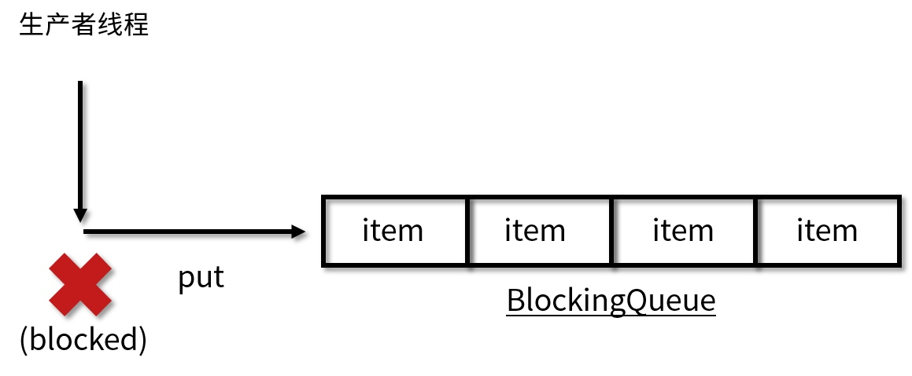
take 方法
take 方法的作用是获取并移除队列的头结点。通常在队列里有数据的时候会正常取出数据并删除；但是如果执行 take 的时候队列里无数据，则阻塞，直到队列里有数据；一旦队列里有数据了，就会立刻解除阻塞状态，并且取到数据。
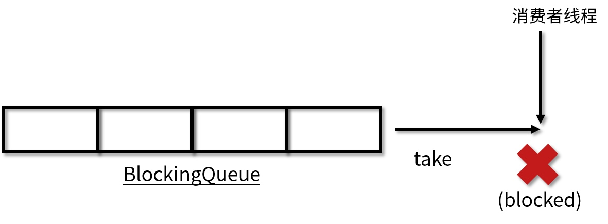
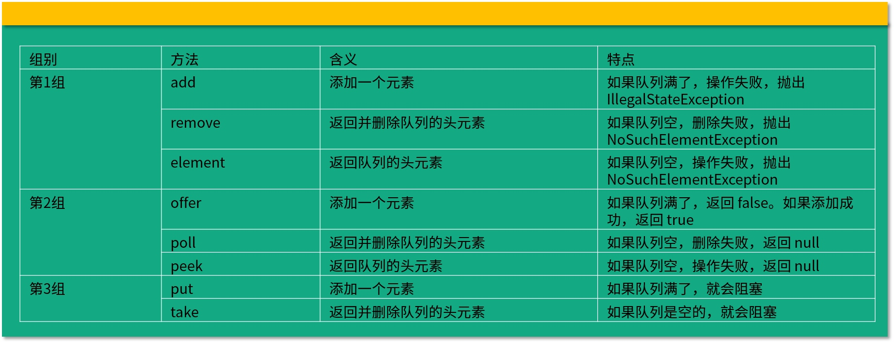


有哪几种常见的阻塞队列？
BlockingQueue 接口的实现类都被放在了 J.U.C 包中，本课时将对常见的和常用的实现类进行介绍，包括 ArrayBlockingQueue、LinkedBlockingQueue、SynchronousQueue、PriorityBlockingQueue，以及 DelayQueue。

ArrayBlockingQueue
让我们先从最基础的 ArrayBlockingQueue 说起。ArrayBlockingQueue 是最典型的有界队列，其内部是用数组存储元素的，利用 ReentrantLock 实现线程安全。

我们在创建它的时候就需要指定它的容量，之后也不可以再扩容了，在构造函数中我们同样可以指定是否是公平的，代码如下：

复制代码
ArrayBlockingQueue(int capacity, boolean fair)
第一个参数是容量，第二个参数是是否公平。正如 ReentrantLock 一样，如果 ArrayBlockingQueue 被设置为非公平的，那么就存在插队的可能；如果设置为公平的，那么等待了最长时间的线程会被优先处理，其他线程不允许插队，不过这样的公平策略同时会带来一定的性能损耗，因为非公平的吞吐量通常会高于公平的情况。

LinkedBlockingQueue
正如名字所示，这是一个内部用链表实现的 BlockingQueue。如果我们不指定它的初始容量，那么它容量默认就为整型的最大值 Integer.MAX_VALUE，由于这个数非常大，我们通常不可能放入这么多的数据，所以 LinkedBlockingQueue 也被称作无界队列，代表它几乎没有界限。
SynchronousQueue
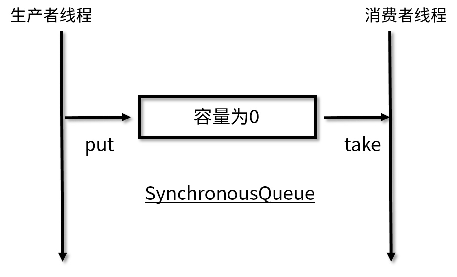
如图所示，SynchronousQueue 最大的不同之处在于，它的容量为 0，所以没有一个地方来暂存元素，导致每次取数据都要先阻塞，直到有数据被放入；同理，每次放数据的时候也会阻塞，直到有消费者来取。

PriorityBlockingQueue
前面我们所说的 ArrayBlockingQueue 和 LinkedBlockingQueue 都是采用先进先出的顺序进行排序，可是如果有的时候我们需要自定义排序怎么办呢？这时就需要使用 PriorityBlockingQueue。

PriorityBlockingQueue 是一个支持优先级的无界阻塞队列，可以通过自定义类实现 compareTo() 方法来指定元素排序规则，或者初始化时通过构造器参数 Comparator 来指定排序规则。同时，插入队列的对象必须是可比较大小的，也就是 Comparable 的，否则会抛出 ClassCastException 异常。

它的 take 方法在队列为空的时候会阻塞，但是正因为它是无界队列，而且会自动扩容，所以它的队列永远不会满，所以它的 put 方法永远不会阻塞，添加操作始终都会成功，也正因为如此，它的成员变量里只有一个 Condition：

DelayQueue
DelayQueue 这个队列比较特殊，具有“延迟”的功能。我们可以设定让队列中的任务延迟多久之后执行，比如 10 秒钟之后执行，这在例如“30 分钟后未付款自动取消订单”等需要延迟执行的场景中被大量使用。

它是无界队列，放入的元素必须实现 Delayed 接口，而 Delayed 接口又继承了 Comparable 接口，所以自然就拥有了比较和排序的能力，代码如下：

复制代码
public interface Delayed extends Comparable<Delayed> {
    long getDelay(TimeUnit unit);
}
可以看出这个 Delayed 接口继承自 Comparable，里面有一个需要实现的方法，就是  getDelay。这里的 getDelay 方法返回的是“还剩下多长的延迟时间才会被执行”，如果返回 0 或者负数则代表任务已过期。

元素会根据延迟时间的长短被放到队列的不同位置，越靠近队列头代表越早过期。

DelayQueue 内部使用了 PriorityQueue 的能力来进行排序，而不是自己从头编写，我们在工作中可以学习这种思想，对已有的功能进行复用，不但可以减少开发量，同时避免了“重复造轮子”，更重要的是，对学到的知识进行合理的运用，让知识变得更灵活，做到触类旁通。

## 阻塞和非阻塞队列的并发安全原理是什么？

阻塞队列最主要是利用了 ReentrantLock 以及它的 Condition 来实现

非阻塞队列ConcurrentLinkedQueue
CAS 方法实现线程安全。

## 如何选择适合自己的阻塞队列？
线程池对于阻塞队列的选择
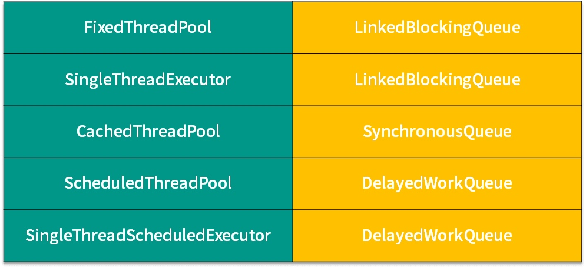


下面让我们总结一下经验，通常我们可以从以下 5 个角度考虑，来选择合适的阻塞队列：

功能

第 1 个需要考虑的就是功能层面，比如是否需要阻塞队列帮我们排序，如优先级排序、延迟执行等。如果有这个需要，我们就必须选择类似于 PriorityBlockingQueue 之类的有排序能力的阻塞队列。

容量

第 2 个需要考虑的是容量，或者说是否有存储的要求，还是只需要“直接传递”。在考虑这一点的时候，我们知道前面介绍的那几种阻塞队列，有的是容量固定的，如 ArrayBlockingQueue；有的默认是容量无限的，如 LinkedBlockingQueue；而有的里面没有任何容量，如 SynchronousQueue；而对于 DelayQueue 而言，它的容量固定就是 Integer.MAX_VALUE。


所以不同阻塞队列的容量是千差万别的，我们需要根据任务数量来推算出合适的容量，从而去选取合适的 BlockingQueue。

能否扩容

第 3 个需要考虑的是能否扩容。因为有时我们并不能在初始的时候很好的准确估计队列的大小，因为业务可能有高峰期、低谷期。


如果一开始就固定一个容量，可能无法应对所有的情况，也是不合适的，有可能需要动态扩容。如果我们需要动态扩容的话，那么就不能选择 ArrayBlockingQueue ，因为它的容量在创建时就确定了，无法扩容。相反，PriorityBlockingQueue 即使在指定了初始容量之后，后续如果有需要，也可以自动扩容。


所以我们可以根据是否需要扩容来选取合适的队列。

内存结构

第 4 个需要考虑的点就是内存结构。在上一课时我们分析过 ArrayBlockingQueue 的源码，看到了它的内部结构是“数组”的形式。


和它不同的是，LinkedBlockingQueue 的内部是用链表实现的，所以这里就需要我们考虑到，ArrayBlockingQueue 没有链表所需要的“节点”，空间利用率更高。所以如果我们对性能有要求可以从内存的结构角度去考虑这个问题。

性能

第 5 点就是从性能的角度去考虑。比如 LinkedBlockingQueue 由于拥有两把锁，它的操作粒度更细，在并发程度高的时候，相对于只有一把锁的 ArrayBlockingQueue 性能会更好。


另外，SynchronousQueue 性能往往优于其他实现，因为它只需要“直接传递”，而不需要存储的过程。如果我们的场景需要直接传递的话，可以优先考虑 SynchronousQueue。


## 原子类是如何利用 CAS 保证线程安全的？
在编程领域里，原子性意味着“一组操作要么全都操作成功，要么全都失败，不能只操作成功其中的一部分”

原子类的作用和锁有类似之处，是为了保证并发情况下线程安全。不过原子类相比于锁，有一定的优势：

粒度更细：原子变量可以把竞争范围缩小到变量级别，通常情况下，锁的粒度都要大于原子变量的粒度。

效率更高：除了高度竞争的情况之外，使用原子类的效率通常会比使用同步互斥锁的效率更高，因为原子类底层利用了 CAS 操作，不会阻塞线程。

| 类型  | 具体类  |
|---|---|
|  Atomic* 基本类型原子类	 | AtomicInteger、AtomicLong、AtomicBoolean |
|  Atomic*Array 数组类型原子类	 | AtomicIntegerArray、AtomicLongArray、AtomicReferenceArray |
|  Atomic*Reference 引用类型原子类		 | AtomicReference、AtomicStampedReference、AtomicMarkableReference |
|  Atomic*FieldUpdater 升级类型原子类	 | AtomicIntegerfieldupdater、AtomicLongFieldUpdater、AtomicReferenceFieldUpdater |
|  Adder 累加器		 | LongAdder、DoubleAdder |
|  Accumulator 积累器		 | LongAccumulator、DoubleAccumulator |

AtomicInteger 类常用方法
AtomicInteger 类有以下几个常用的方法：

public final int get() //获取当前的值

因为它本身是一个 Java 类，而不再是一个基本类型，所以要想获取值还是需要一些方法，比如通过 get 方法就可以获取到当前的值。

public final int getAndSet(int newValue) //获取当前的值，并设置新的值

接下来的几个方法和它平时的操作相关：

public final int getAndIncrement() //获取当前的值，并自增

public final int getAndDecrement() //获取当前的值，并自减

public final int getAndAdd(int delta) //获取当前的值，并加上预期的值
	
	

​	

getAndAdd方法
这个方法的代码在 Java 1.8 中的实现如下：

复制代码
//JDK 1.8实现
public final int getAndAdd(int delta) {
   return unsafe.getAndAddInt(this, valueOffset, delta);
}
可以看出，里面使用了 Unsafe 这个类，并且调用了 unsafe.getAndAddInt 方法。所以这里需要简要介绍一下 Unsafe 类。

Unsafe 类
Unsafe 类主要是用于和操作系统打交道的，因为大部分的 Java 代码自身无法直接操作内存，所以在必要的时候，可以利用 Unsafe 类来和操作系统进行交互，CAS 正是利用到了 Unsafe 类。

那么我们就来看一下 AtomicInteger 的一些重要代码，如下所示：
public class AtomicInteger extends Number implements java.io.Serializable {
   // setup to use Unsafe.compareAndSwapInt for updates
   private static final Unsafe unsafe = Unsafe.getUnsafe();
   private static final long valueOffset;

   static {
       try {
           valueOffset = unsafe.objectFieldOffset
               (AtomicInteger.class.getDeclaredField("value"));
       } catch (Exception ex) { throw new Error(ex); }
   }

   private volatile int value;
   public final int get() {return value;}
   ...
}
可以看出，在数据定义的部分，首先还获取了 Unsafe 实例，并且定义了 valueOffset。我们往下看到 static 代码块，这个代码块会在类加载的时候执行，执行时我们会调用 Unsafe 的 objectFieldOffset 方法，从而得到当前这个原子类的 value 的偏移量，并且赋给 valueOffset 变量，这样一来我们就获取到了 value 的偏移量，它的含义是在内存中的偏移地址，因为 Unsafe 就是根据内存偏移地址获取数据的原值的，这样我们就能通过 Unsafe 来实现 CAS 了。

value 是用 volatile 修饰的，它就是我们原子类存储的值的变量，由于它被 volatile 修饰，我们就可以保证在多线程之间看到的 value 是同一份，保证了可见性。

接下来继续看 Unsafe 的 getAndAddInt 方法的实现，代码如下：

```
/**
 * Atomically adds the given value to the current value of a field
 * or array element within the given object <code>o</code>
 * at the given <code>offset</code>.
 *
 * @param o object/array to update the field/element in
 * @param offset field/element offset
 * @param delta the value to add
 * @return the previous value
 * @since 1.8
 */
public final int getAndAddInt(Object o, long offset, int delta) {
    int v;
    do {
        v = getIntVolatile(o, offset);
    } while (!compareAndSwapInt(o, offset, v, v + delta));
    return v;
}
```

它实现的原理是利用自旋去不停地尝试，直到成功为止。


## AtomicInteger 在高并发下性能不好，如何解决？为什么？

代码的运行结果同样是 100，但是运行速度比刚才 AtomicLong 的实现要快。下面我们解释一下，为什么高并发下 LongAdder 比 AtomicLong 效率更高。

因为 LongAdder 引入了分段累加的概念，内部一共有两个参数参与计数：第一个叫作 base，它是一个变量，第二个是 Cell[] ，是一个数组。


如何选择
在低竞争的情况下，AtomicLong 和 LongAdder 这两个类具有相似的特征，吞吐量也是相似的，因为竞争不高。但是在竞争激烈的情况下，LongAdder 的预期吞吐量要高得多，经过试验，LongAdder 的吞吐量大约是 AtomicLong 的十倍，不过凡事总要付出代价，LongAdder 在保证高效的同时，也需要消耗更多的空间。


AtomicLong 可否被 LongAdder 替代？
那么我们就要考虑了，有了更高效的 LongAdder，那 AtomicLong 可否不使用了呢？是否凡是用到 AtomicLong 的地方，都可以用 LongAdder 替换掉呢？答案是不是的，这需要区分场景。

LongAdder 只提供了 add、increment 等简单的方法，适合的是统计求和计数的场景，场景比较单一，而 AtomicLong 还具有 compareAndSet 等高级方法，可以应对除了加减之外的更复杂的需要 CAS 的场景。

结论：如果我们的场景仅仅是需要用到加和减操作的话，那么可以直接使用更高效的 LongAdder，但如果我们需要利用 CAS 比如 compareAndSet 等操作的话，就需要使用 AtomicLong 来完成。


“老师，LongAdder 既然最后在相加的时候可能不准确，那不也是线程不安全的么，为什么还要使用呢？”

https://www.cnblogs.com/thisiswhy/p/13176237.html


## 原子类和 volatile 有什么异同？


之所以加了关键字之后就就可以让它拥有可见性，原因在于有了这个关键字之后，线程 1 的更改会被 flush 到共享内存中，然后又会被 refresh 到线程 2 的本地内存中，这样线程 2 就能感受到这个变化了，所以 volatile 这个关键字最主要是用来解决可见性问题的，可以一定程度上保证线程安全。

原子类和 volatile 的使用场景


那下面我们就来说一下原子类和 volatile 各自的使用场景。


我们可以看出，volatile 和原子类的使用场景是不一样的，**如果我们有一个可见性问题，那么可以使用 volatile 关键字**，但如果我们的问题是一个组合操作，需要用同步来解决原子性问题的话，那么可以使用原子变量，而不能使用 volatile 关键字。


通常情况下，volatile 可以用来修饰 boolean 类型的标记位，因为对于标记位来讲，直接的赋值操作本身就是具备原子性的，再加上 volatile 保证了可见性，那么就是线程安全的了。


而对于会被多个线程同时操作的计数器 Counter 的场景，这种场景的一个典型特点就是，它不仅仅是一个简单的赋值操作，而是需要先读取当前的值，然后在此基础上进行一定的修改，再把它给赋值回去。这样一来，我们的 volatile 就不足以保证这种情况的线程安全了。我们需要使用原子类来保证线程安全。


## Java 8 中 Adder 和 Accumulator 有什么区别？

适用场景
接下来我们说一下 LongAccumulator 的适用场景。

第一点需要满足的条件，就是需要大量的计算，并且当需要并行计算的时候，我们可以考虑使用 LongAccumulator。

当计算量不大，或者串行计算就可以满足需求的时候，可以使用 for 循环；如果计算量大，需要提高计算的效率时，我们则可以利用线程池，再加上 LongAccumulator 来配合的话，就可以达到并行计算的效果，效率非常高。

第二点需要满足的要求，就是计算的执行顺序并不关键，也就是说它不要求各个计算之间的执行顺序，也就是说线程 1 可能在线程 5 之后执行，也可能在线程 5 之前执行，但是执行的先后并不影响最终的结果。

一些非常典型的满足这个条件的计算，就是类似于加法或者乘法，因为它们是有交换律的。同样，求最大值和最小值对于顺序也是没有要求的，因为最终只会得出所有数字中的最大值或者最小值，无论先提交哪个或后提交哪个，都不会影响到最终的结果。


## ThreadLocal 适合用在哪些实际生产的场景中

在通常的业务开发中，ThreadLocal 有两种典型的使用场景。

场景1，ThreadLocal 用作保存每个线程独享的对象，为每个线程都创建一个副本，这样每个线程都可以修改自己所拥有的副本, 而不会影响其他线程的副本，确保了线程安全。

场景2，ThreadLocal 用作每个线程内需要独立保存信息，以便供其他方法更方便地获取该信息的场景。每个线程获取到的信息可能都是不一样的，前面执行的方法保存了信息后，后续方法可以通过 ThreadLocal 直接获取到，避免了传参，类似于全局变量的概念。


典型场景1
这种场景通常用于保存线程不安全的工具类，典型的需要使用的类就是 SimpleDateFormat。

场景介绍
在这种情况下，每个 Thread 内都有自己的实例副本，且该副本只能由当前 Thread 访问到并使用，相当于每个线程内部的本地变量，这也是 ThreadLocal 命名的含义。因为每个线程独享副本，而不是公用的，所以不存在多线程间共享的问题。

我们希望达到的效果是，既不浪费过多的内存，同时又想保证线程安全。经过思考得出，可以让每个线程都拥有一个自己的 simpleDateFormat 对象来达到这个目的，这样就能两全其美了


总结
ThreadLocal 的两个典型的使用场景。

场景1，ThreadLocal 用作保存每个线程独享的对象，为每个线程都创建一个副本，每个线程都只能修改自己所拥有的副本, 而不会影响其他线程的副本，这样就让原本在并发情况下，线程不安全的情况变成了线程安全的情况。

场景2，ThreadLocal 用作每个线程内需要独立保存信息的场景，供其他方法更方便得获取该信息，每个线程获取到的信息都可能是不一样的，前面执行的方法设置了信息后，后续方法可以通过 ThreadLocal 直接获取到，避免了传参。