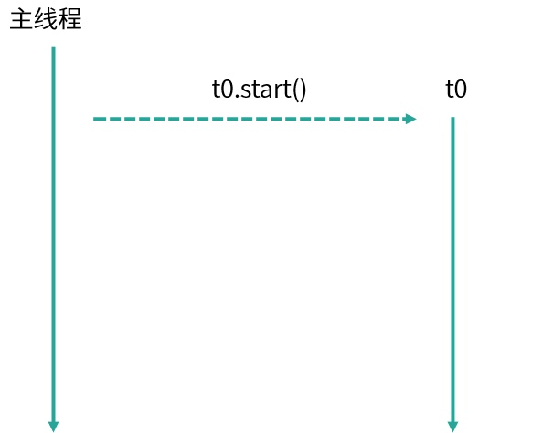
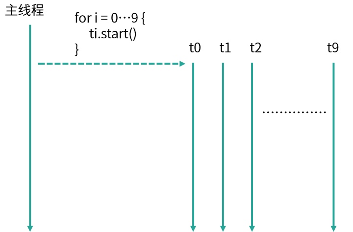
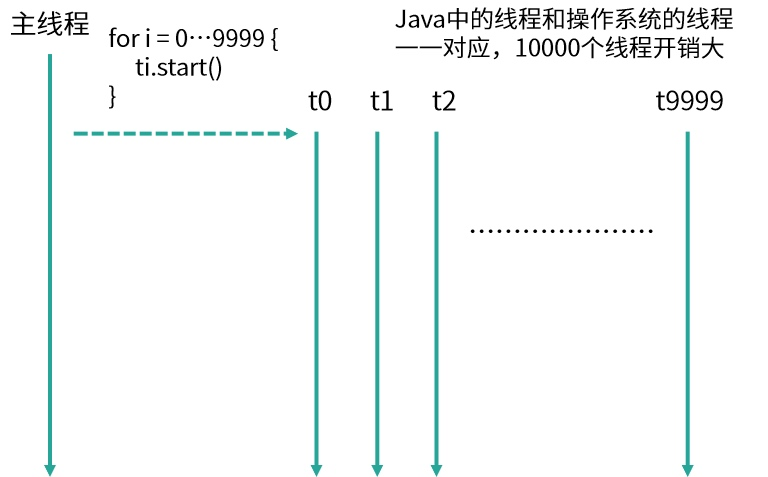
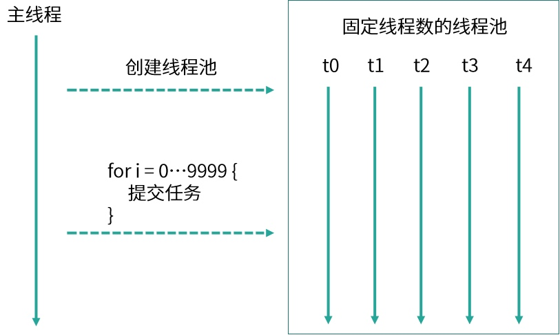

## 使用线程池比手动创建线程好在哪里？

Thread Name: Thread-5
Thread Name: Thread-7
Thread Name: Thread-8
Thread Name: Thread-9
Thread Name: Thread-4
Thread Name: Thread-2
Thread Name: Thread-1
Thread Name: Thread-3
Thread Name: Thread-0
Thread Name: Thread-6

这里你会发现，打印出来的顺序是错乱的，比如 Thread-4 打印在了 Thread-3 之前，这是因为，虽然  Thread-3 比  Thread-4 先执行 start 方法，但是这并不代表  Thread-3 就会先运行，运行的顺序取决于线程调度器，有很大的随机性，这是需要我们注意的地方。

....
Thread Name: Thread-9994
Thread Name: Thread-9995
Thread Name: Thread-9996
Thread Name: Thread-9997
Thread Name: Thread-9998
Thread Name: Thread-9999

我们来总结下如果每个任务都创建一个线程会带来哪些问题：

第一点，反复创建线程系统开销比较大，每个线程创建和销毁都需要时间，如果任务比较简单，那么就有可能导致创建和销毁线程消耗的资源比线程执行任务本身消耗的资源还要大。
第二点，过多的线程会占用过多的内存等资源，还会带来过多的上下文切换，同时还会导致系统不稳定。

**线程池解决问题思路**
针对上面的两点问题，线程池有两个解决思路。

首先，针对反复创建线程开销大的问题，线程池用一些固定的线程一直保持工作状态并反复执行任务。

其次，针对过多线程占用太多内存资源的问题，解决思路更直接，线程池会根据需要创建线程，控制线程的总数量，避免占用过多内存资源。

**如何使用线程池**

**使用线程池比手动创建线程主要有三点好处。**
[使用线程池的好处：1. 降低资源消耗2. 提高响应速度3. 提高线程的可管理性]

第一点，线程池可以解决线程生命周期的系统开销问题，同时还可以加快响应速度。因为线程池中的线程是可以复用的，我们只用少量的线程去执行大量的任务，这就大大减小了线程生命周期的开销。而且线程通常不是等接到任务后再临时创建，而是已经创建好时刻准备执行任务，这样就消除了线程创建所带来的延迟，提升了响应速度，增强了用户体验。
第二点，线程池可以统筹内存和 CPU 的使用，避免资源使用不当。线程池会根据配置和任务数量灵活地控制线程数量，不够的时候就创建，太多的时候就回收，避免线程过多导致内存溢出，或线程太少导致 CPU 资源浪费，达到了一个完美的平衡。
第三点，线程池可以统一管理资源。比如线程池可以统一管理任务队列和线程，可以统一开始或结束任务，比单个线程逐一处理任务要更方便、更易于管理，同时也有利于数据统计，比如我们可以很方便地统计出已经执行过的任务的数量。