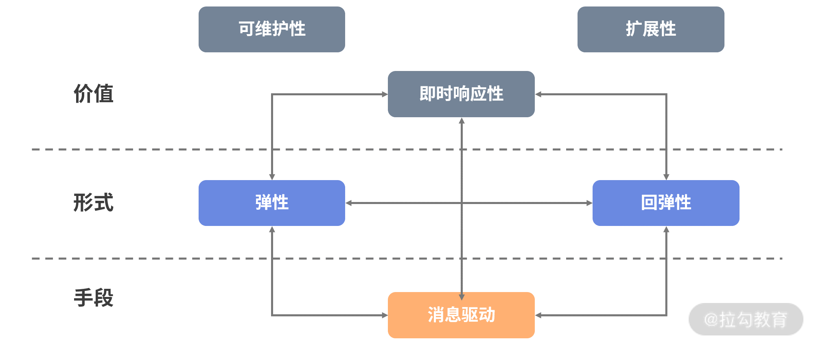
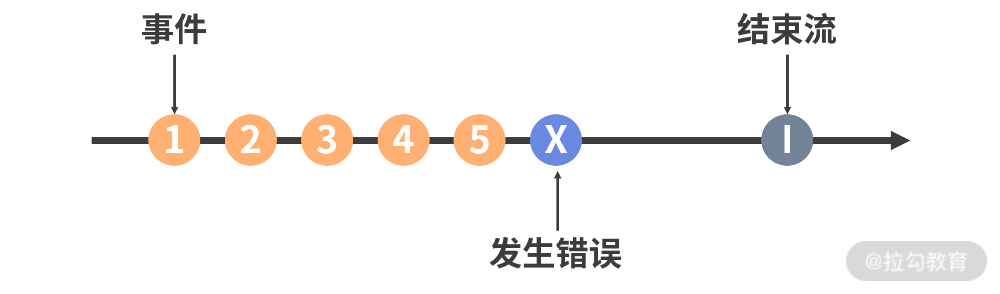
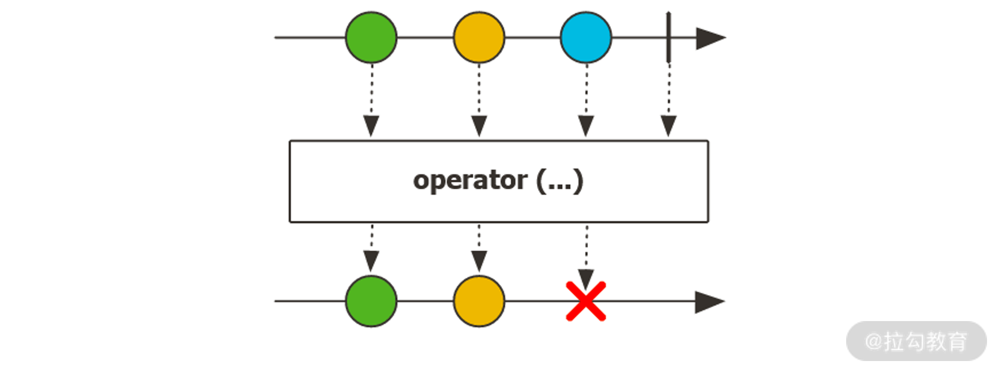
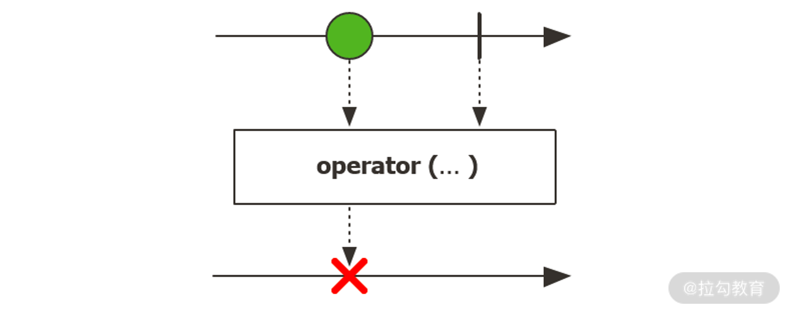

## 响应式编程实现方法

### 观察者模式和发布-订阅模式
在引入响应式编程技术之前，我们同样先来回顾一个大家可能都知道的设计模式，即观察者模式。观察者模式拥有一个主题（Subject），其中包含其依赖者列表，这些依赖者被称为观察者（Observer）。主题可以通过一定的机制将任何状态变化通知到观察者

### 响应式宣言和响应式系统
可以看到，即时响应性（Responsive）、回弹性（Resilient）、弹性（Elastic）以及消息驱动（Message Driven）构成了响应式宣言的主体内容。响应式宣言认为，具备上图中各个特性的系统，就可以称为响应式系统。

### 背压机制
讲到这里，我们已经明确，纯“推”模式下的数据流量会有很多不可控制的因素，并不能直接应用，而是需要在“推”模式和“拉”模式之间考虑一定的平衡性，从而优雅地实现流量控制。这就需要引出响应式系统中非常重要的一个概念——背压机制（Backpressure）。

Reactor 异步数据序列
响应式流规范的基本组件是一个异步的数据序列，在 Reactor 框架中，我们可以把这个异步数据序列表示成如下形式。

### Flux 和 Mono 组件
Flux 代表的是一个包含 0 到 n 个元素的异步序列，Reactor 官网给出了它的示意图，如下所示。

Mono 数据序列中只包含 0 个或 1 个元素，如下图所示。

